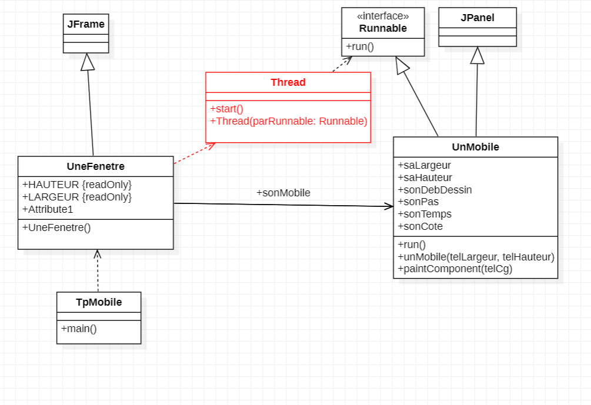
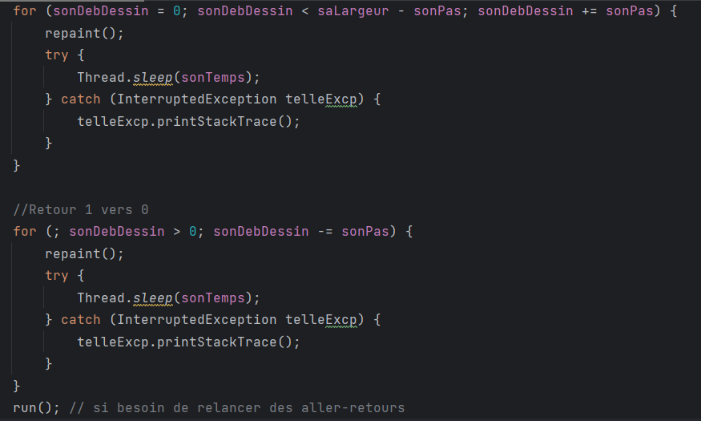
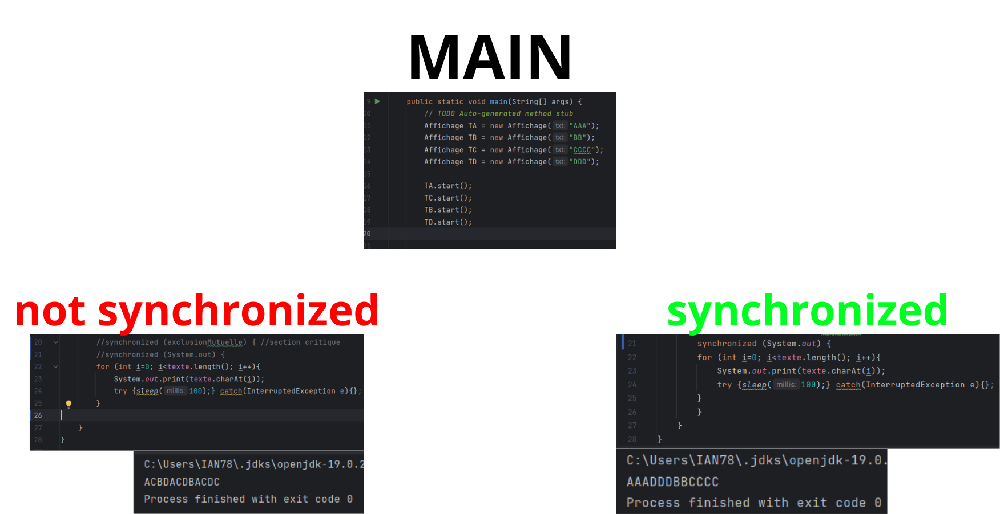
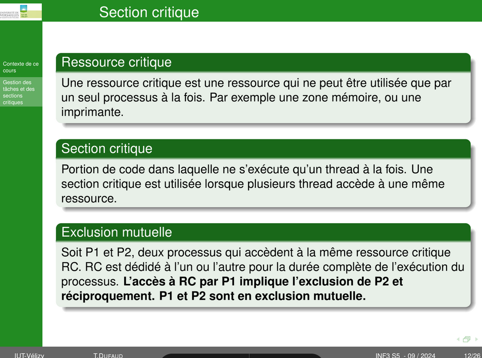

Mail : thomas.dufaud@uvsq.fr
# Sommaire :
* [TP0](#cours-1--tp-0)
* [TP1](#cours-2--tp1)
* [TP2](#cours-3--tp2)
* [TP3](#cours-4--tp3)

# COURS 1 : TP 0

**Paradigme :** Structure d’algorithmes

**Framework :** Ensemble d’outils, de composants et de bibliothèques préconçues donnant structure de base pour le développement

### Pour la SAÉ
* Bien faire le git d’un projet et bien faire les tests avec dufaud
* **Préparation à la SAE :**
  *  La SAE tournera sur plusieurs raspberries en cluster. Évalue les perf…

### Pour le module
* Contrôle continu
  * Deux rapports sur l’ensemble des TP :
    * Synthèse de cours, etc
  * 1 contrôle court (30m) (peut être deux)
* Utiliser starUML

### Notions de cours 
Plusieurs serveurs ⇒ **load balancing**

Processeur multi coeur | **un coeur** ⇒ plusieurs transistors : donc plusieurs unités de transistors

**Fréquence :** tick d’horloge

Distinguer la différence de quand utiliser cpu et gpu pour les calculs du cours/SAE

---
* Transparence à la localisation : lien hypertexte
* Transparence d’accès : URL
* Désignation : URL, DNS
* Interopérabilité : pages HTML, web service

---
* Tâche : bout de code
* Processus : ce qui va porter la tâche le mettre en mémoire etc
* Processeur : ce qui exécute le processus

### Infos random
Mr Dufaud a travaillé sur le pc **Fugaku**

Regarder plus en détails c'est quoi un FPGA

**6 semaines à partir du 13/09 :** Rapport ou un truc dans le genre

# TD 0
Quel est l’architecture matérielle utilisée dans la salle

CPU : Processeur

	Intel(R) Core(TM) i7-7700 CPU @ 3.60GHz

	Vitesse de base :	3,60 GHz
	Sockets :	1
	Cœurs :	4
	Processeurs logiques :	8
	Virtualisation :	Activé
	Cache de niveau 1 :	256 Ko
	Cache de niveau 2 :	1,0 Mo
	Cache de niveau 3 :	8,0 Mo

	Utilisation	6%
	Vitesse	4,07 GHz
	Durée de fonctionnement	0:02:24:54
	Processus	121
	Threads	1740
	Handles	57051
RAM : Mémoire

	32,0 Go

	Vitesse :	2400 MHz
	Emplacements utilisés :	4 de 4
	Facteur de forme :	DIMM
	Matériel réservé :	117 Mo

	Disponible	26,4 Go
	Mise en cache	6,5 Go
	Validée	5,7/33,9 Go
	Réserve paginée	365 Mo
	Pool non paginé	144 Mo
	Utilisée (compressée)	5,1 Go (0 Mo)
GPU : GPU 0

	Intel(R) HD Graphics 630

	Version du pilote :	27.20.100.9664
	Date du pilote :	01/06/2021
	Version DirectX :	12 (FL 12.1)
	Emplacement physique :	Bus PCI 0, périphérique 2, fonction 0

	Utilisation	3%
	Mémoire du GPU dédiée    
	Mémoire du GPU partagée	0,4/15,9 Go
	Mémoire du processeur graphique	0,4/15,9 Go

Architecture matérielle de mon téléphone

CPU : Exynos 2400 Deca-Core cadencé à 3.1 GHz

RAM : 12 Go

-------

# COURS 2 : TP1
_(Le contenu du cours n'est pas accurate, du contenu a été rajouté au fur et a mesure que j'ai travaillé sur le TP pendant les séances suivantes.)_

_J'ai aussi utilisé ChatGPT afin de mieux comprendre certaines notions du cours, j'ai aussi consulté de la documentation en ligne pour des notions mineure en java (génération de nombre aléatoire)_

### Question 2 : Faire en sorte que le mobile reparte en sens inverse lorsqu'il atteint une extrémité de la fenêtre
Pour faire en sorte qu'il revienne sur ses pas, on vient copier la boucle précédente en modifiant les paramètres afin qu'il refasse le même chemin pour le retour.

Ensuite, si l'on souhaite qu'il fasse l'opération en boucle, on vient faire un appel récursif dans la méthode `run()`, qui relancera un aller-retour, dès qu'il aura fini son précédent.
### Question 3 : Faire avancer 4 carrés en faisant en sorte qu'il y en ait qu'un seul à la fois qui peut circuler dans la zone du milieu

Pour réaliser cela, j'ai copié mes précédentes boucles issues de la question précédente afin de définir 3 "Zones" :
1. Allant de 0 à 1
2. Allant de 1 à 2
3. Allant de 2 à 3

Pour restreindre l'accès à la deuxième zone, je verrouille mon 
sémaphore lorsqu'on entre de la deuxième zone 
(que ce soit sur l'aller ou sur le retour), puis je le déverrouille 
une fois qu'on a passé la zone. 
Cela assure que lorsqu'un carré arrive à cette zone, il soit incapable de la franchir si un autre est déjà en train de le faire.

Vous pouvez tester visuellement en executant la classe `TpMobile`.

# COURS 3 : TP2

# COURS 4 : TP3

# Notions / Cours

_(Ce schéma donne le même résultat que ce soit avec des synchronize ou un sémaphore)_

Le synchronize permet de faire en sorte que les threads ne s'exécutent pas simultanément et attendent la fin du précédent thread pour pouvoir s'éxecuter.

De la même façon qu'avec le synchronized, on peut encadrer la section critique avec le sémaphore, on peut recréer une "file d'attente" des threads

**Connaitre les définitions suivantes**

Sémaphore Binaire (ma définition🤓) : Variable dont on contrôle l'accès de façon binaire (Occupée/Libre) à la manière d'un verrou MUTEX. Cela permet d'empêcher d'éventuels problèmes liés au partage de cette variable entre plusieurs objets.
---