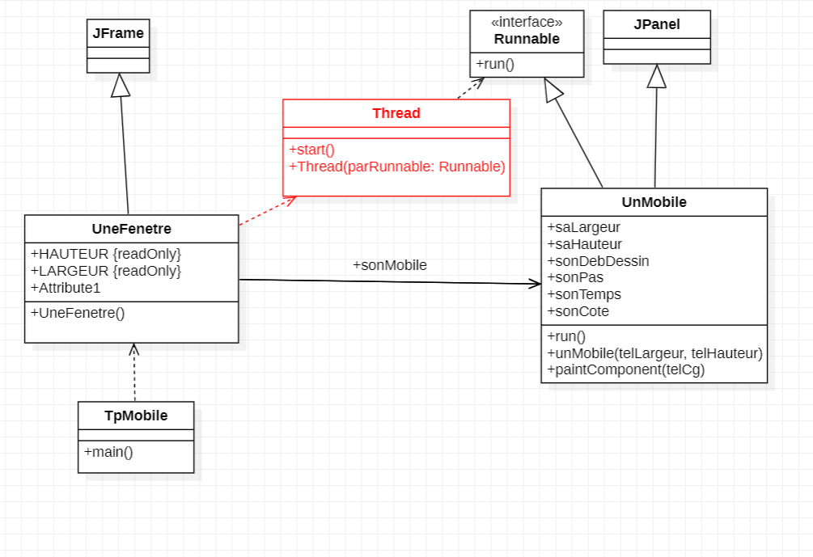
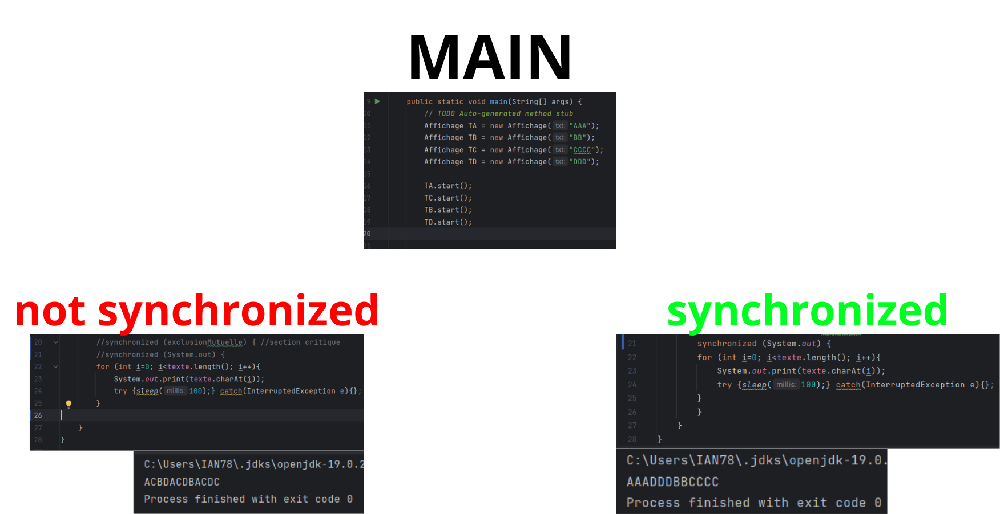

> Rédacteur : Florian DE SOUSA INFO3-FA

> Matière : Programmation Avancée
>
> Professeur : Thomas Dufaud (thomas.dufaud@uvsq.fr)

_J'ai utilisé ChatGPT afin de mieux comprendre certaines notions du cours, j'ai aussi consulté de la documentation en ligne pour des notions mineure en java (génération de nombre aléatoire, par exemple)_

# Sommaire :
* [TP0](#cours-1--tp-0)
* [TP1](#cours-2--tp1)
* [TP2](#cours-3--tp2)
* [TP3](#cours-4-5--tp3)

# COURS 1 : TP 0

**Paradigme :** Structure d’algorithmes

**Framework :** Ensemble d’outils, de composants et de bibliothèques préconçues donnant structure de base pour le développement

### Pour la SAÉ
* Bien faire le git d’un projet et bien faire les tests avec dufaud
* **Préparation à la SAE :**
  *  La SAE tournera sur plusieurs raspberries en cluster. Évalue les perf…

### Pour le module
* Contrôle continu
  * Deux rapports sur l’ensemble des TP :
    * Synthèse de cours, etc
  * 1 contrôle court (30m) (peut être deux)
* Utiliser starUML

### Notions de cours 
Plusieurs serveurs ⇒ **load balancing**

Processeur multi coeur | **un coeur** ⇒ plusieurs transistors : donc plusieurs unités de transistors

**Fréquence :** tick d’horloge

Distinguer la différence de quand utiliser cpu et gpu pour les calculs du cours/SAE

---
* Transparence à la localisation : lien hypertexte
* Transparence d’accès : URL
* Désignation : URL, DNS
* Interopérabilité : pages HTML, web service

---
* Tâche : bout de code
* Processus : ce qui va porter la tâche le mettre en mémoire etc
* Processeur : ce qui exécute le processus


### Infos random
Mr Dufaud a travaillé sur le pc **Fugaku**

Regarder plus en détails c'est quoi un FPGA


**6 semaines à partir du 13/09 :** Rapport ou un truc dans le genre


# TD 0
Quel est l’architecture matérielle utilisée dans la salle


CPU : Processeur

	Intel(R) Core(TM) i7-7700 CPU @ 3.60GHz

	Vitesse de base :	3,60 GHz
	Sockets :	1
	Cœurs :	4
	Processeurs logiques :	8
	Virtualisation :	Activé
	Cache de niveau 1 :	256 Ko
	Cache de niveau 2 :	1,0 Mo
	Cache de niveau 3 :	8,0 Mo

	Utilisation	6%
	Vitesse	4,07 GHz
	Durée de fonctionnement	0:02:24:54
	Processus	121
	Threads	1740
	Handles	57051
RAM : Mémoire

	32,0 Go

	Vitesse :	2400 MHz
	Emplacements utilisés :	4 de 4
	Facteur de forme :	DIMM
	Matériel réservé :	117 Mo

	Disponible	26,4 Go
	Mise en cache	6,5 Go
	Validée	5,7/33,9 Go
	Réserve paginée	365 Mo
	Pool non paginé	144 Mo
	Utilisée (compressée)	5,1 Go (0 Mo)
GPU : GPU 0

	Intel(R) HD Graphics 630

	Version du pilote :	27.20.100.9664
	Date du pilote :	01/06/2021
	Version DirectX :	12 (FL 12.1)
	Emplacement physique :	Bus PCI 0, périphérique 2, fonction 0

	Utilisation	3%
	Mémoire du GPU dédiée    
	Mémoire du GPU partagée	0,4/15,9 Go
	Mémoire du processeur graphique	0,4/15,9 Go

Architecture matérielle de mon téléphone

CPU : Exynos 2400 Deca-Core cadencé à 3.1 GHz

RAM : 12 Go

-------

# COURS 2 : TP1
_(Le contenu d'un "cours" n'est pas accurate, du contenu a été rajouté au fur et a mesure que j'ai travaillé sur le TP pendant les séances suivantes.)_


### Question 2 : Faire en sorte que le mobile reparte en sens inverse lorsqu'il atteint une extrémité de la fenêtre
Pour faire en sorte qu'il revienne sur ses pas, on vient copier la boucle précédente en modifiant les paramètres afin qu'il refasse le même chemin pour le retour.
```java
public void run() {
  //Aller 0 vers 1
  for (sonDebDessin = 0; sonDebDessin < saLargeur - sonPas; sonDebDessin += sonPas) {
      repaint();
      try {
          Thread.sleep(sonTemps);
      } catch (InterruptedException telleExcp) {
          telleExcp.printStackTrace();
      }
  }
  //Retour 1 vers 0
  for (; sonDebDessin > 0; sonDebDessin -= sonPas) {
      repaint();
      try {
          Thread.sleep(sonTemps);
      } catch (InterruptedException telleExcp) {
          telleExcp.printStackTrace();
      }
  }
  run(); // si besoin de relancer des aller-retours
}
```

Ensuite, si l'on souhaite qu'il fasse l'opération en boucle, on vient faire un appel récursif dans la méthode `run()`, qui relancera un aller-retour, dès qu'il aura fini son précédent.
### Question 3 : Faire avancer 4 carrés en faisant en sorte qu'il y en ait qu'un seul à la fois qui peut circuler dans la zone du milieu


Pour réaliser cela, j'ai copié mes précédentes boucles issues de la question précédente afin de définir 3 "Zones" :
1. Allant de 0 à 1
2. Allant de 1 à 2
3. Allant de 2 à 3

Pour restreindre l'accès à la deuxième zone, je verrouille mon 
sémaphore lorsqu'on entre de la deuxième zone 
(que ce soit sur l'aller ou sur le retour), puis je le déverrouille 
une fois qu'on a passé la zone. 
Cela assure que lorsqu'un carré arrive à cette zone, il soit incapable 
de la franchir si un autre est déjà en train de le faire.

Vous pouvez tester visuellement en executant la classe `TpMobile`.

# COURS 3 : TP2
Dans ce TP il nous a été demandé d'encadrer [une section critique](#synchronized) du code 
à l'aide d'un "synchronize" dans un premier temps, puis le remplacer par 
un sémaphore.
Les deux ayant un fonctionnement similaire.


_(Ce schéma donne le même résultat que ce soit avec des synchronize ou un sémaphore)_

Ainsi, que ce soit avec les "synchronized" ou les sémaphores les lettres s'affichent pas "toutes en même temps" et attendent que les précédentes lettres aient étés affichés pour afficher les prochaines.

Cela forme une sorte de "file d'attente", dans laquelle les processus attendent que le précédent ait fini sa tâche pour faire la sienne.

# COURS 4-5 : TP3
Dans ce TP, nous avons dû nous calquer sur l'[exemple donné dans le cours](https://blog.paumard.org/cours/java-api/chap05-concurrent-queues.html).

Ainsi, nous avons dû adapter l'exemple de la Boulangerie, avec celle d'une boite aux lettres. Nous devions avoir une **Boite aux lettres (BAL)** qui peut recevoir/donner des lettres avec un espace limité (utilisant une **BlockingQueue**).

#### Représentation UML des classes impliqués :

#### BAL (BoiteAuLettre)
```java
private BlockingQueue<String> queue = new ArrayBlockingQueue<>(3);

    public synchronized boolean deposer(String lettre)  throws InterruptedException {
        return queue.offer(lettre,  200, TimeUnit.MILLISECONDS) ;
    }

    public synchronized String retirer() throws InterruptedException {
        return queue.poll(200, TimeUnit.MILLISECONDS);
    }

    public int getStock() {
        return queue.size();
    }
```
On a les méthodes deposer/retirer, qui permettent de gérer la BlockingQueue en entrant/sortant des Lettres de la BAL. Ainsi elle permet de partager des données d'une classe à l'autre (Producteur - Consommateur).

Dans le cas présent, nous avons restreint la taille de la file de la BAL à 3. Si le thread "plante", on attends 200 ms avant de redonner l'acces aux threads à la section critique.

#### Producteur
```java
public void run() {
        try {
            for (String lettreADeposer: lettresADeposer) {
                Thread.sleep(1000); // délai ajustable a souhait afin de voir les différents comportements de la BAL
                boolean isDelivered = boiteAuLettre.deposer(lettreADeposer);
                    if (isDelivered) {
                        System.out.println("Producteur a déposé la lettre " + lettreADeposer);
                    } else {
                        System.out.println("BAL pleine");
                    }
            }
            System.out.println("Producteur a fini de tout déposer");
```
Permet de déposer des lettres à un intervalle fréquent (1 seconde dans le cas présent) qui est ajustable en fonction des comportements de la BAL que nous souhaitons tester.

#### Consommateur
```java
public void run() {
    try {
        while (true) {
            Thread.sleep(20); // délai ajustable a souhait afin de voir les différents comportements de la BAL

            lettreRecue = boiteAuLettre.retirer();

            if (lettreRecue == null) {
                System.out.println("Consommateur : Aucune lettre dans la BAL");
            } else if (lettreRecue.contains("*")) {
                System.out.println("Consommateur : On arrête de prendre des lettres, c'était la dernière");
            } else {
                System.out.println("Consommateur : A récupéré la lettre " + lettreRecue + " | Il reste " + boiteAuLettre.getStock() + " lettre");
```
De la même façon que le Producteur, il va pouvoir récupérer une lettre à un intervalle fréquent (ajustable) afin de tester les comportements de la BAL.
# Notions / Cours
#### Section critique
Une section critique est une partie du code où l'on doit s'assurer qu'il y a un seul thread qui accède à cette dernière, car cela pourrait altérer son bon fonctionnement. Dans ce cours, nous avons utilisé des sémaphores ainsi que des "synchronized" afin de s'assurer qu'une section critique soit respectée. 

#### synchronized
Le synchronize permet de faire en sorte que les threads ne s'exécutent pas simultanément et attendent la fin du précédent thread pour pouvoir s'éxecuter.

De la même façon qu'avec le synchronized, on peut encadrer la section critique avec le sémaphore, on peut recréer une "file d'attente" des threads

#### Sémaphore Binaire
Variable dont on contrôle l'accès de façon binaire (Occupée/Libre) à la manière d'un verrou MUTEX. Cela permet d'empêcher d'éventuels problèmes liés au partage de cette variable entre plusieurs objets.

#### BlockedQueue
File d'attente qui gère les threads lui permettant dans le cas où elle est pleine (ou vide) de faire attendre les Threads qui ajoutent/retirent des éléments de la file.

#### Connaitre les définitions suivantes


