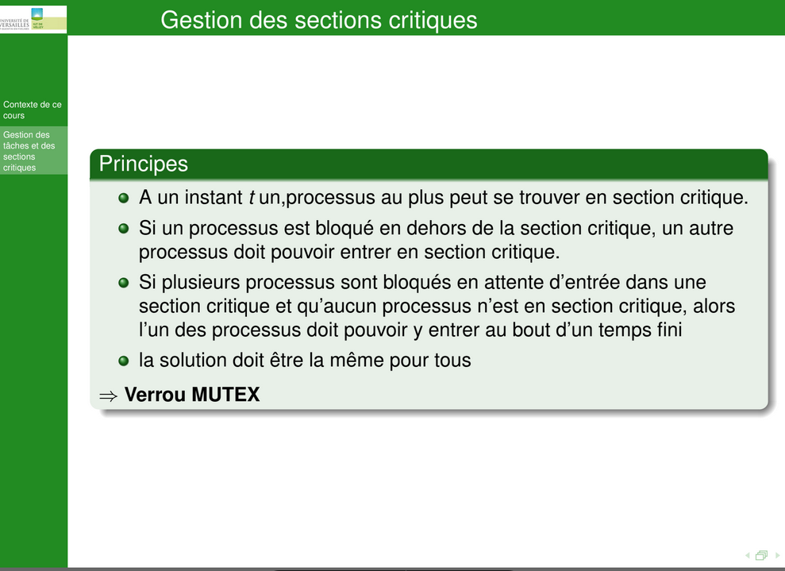

Mail : thomas.dufaud@uvsq.fr

**Paradigme :** Structure d’algorithmes

**Framework :** Ensemble d’outils, de composants et de bivliothèques préconcues donnant structure de base pour le développement

### Pour la SAÉ
* Bien faire le git d’un projet et bien faire les tests avec dufaud
* **Préparation à la SAE :**
  *  La SAE tournera sur plusieurs raspberries en cluster. Évalue les perf…

### Pour le module
* Contrôle continu
  * Deux rapports sur l’ensemble des TP :
    * Synthèse de cours, etc
  * 1 contrôle court (30m) (peut être deux)
* Utiliser starUML

### Notions de cours 
Plusieurs serveurs ⇒ **load balancing**

Processeur multi coeur | **un coeur** ⇒ plusieurs transistors : donc plusieurs unités de transistors

**fréquence :** tick d’horloge

Distinguer la différence de quand utiliser cpu et gpu pour les calculs du cours/SAE

---
* Transparence à la localisation : lien hypertexte
* Transparence d’accès : URL
* Désignation : URL, DNS
* Interopérabilité : pages HTML, web service

---
* Tâche : bout de code
* Processus : ce qui va porter la tâche le mettre en mémoire etc
* Processeur : ce qui exécute le processus

### Infos random
Mr Dufaud a travaillé sur le pc **Fugaku**

Regarder plus en détails c'est quoi un FPGA

**6 semaines à partir du 13/09 :** Rapport ou un truc dans le genre

# TD 0
Quel est l’architecture matérielle utilisée dans la salle

CPU : Processeur

	Intel(R) Core(TM) i7-7700 CPU @ 3.60GHz

	Vitesse de base :	3,60 GHz
	Sockets :	1
	Cœurs :	4
	Processeurs logiques :	8
	Virtualisation :	Activé
	Cache de niveau 1 :	256 Ko
	Cache de niveau 2 :	1,0 Mo
	Cache de niveau 3 :	8,0 Mo

	Utilisation	6%
	Vitesse	4,07 GHz
	Durée de fonctionnement	0:02:24:54
	Processus	121
	Threads	1740
	Handles	57051
RAM : Mémoire

	32,0 Go

	Vitesse :	2400 MHz
	Emplacements utilisés :	4 de 4
	Facteur de forme :	DIMM
	Matériel réservé :	117 Mo

	Disponible	26,4 Go
	Mise en cache	6,5 Go
	Validée	5,7/33,9 Go
	Réserve paginée	365 Mo
	Pool non paginé	144 Mo
	Utilisée (compressée)	5,1 Go (0 Mo)
GPU : GPU 0

	Intel(R) HD Graphics 630

	Version du pilote :	27.20.100.9664
	Date du pilote :	01/06/2021
	Version DirectX :	12 (FL 12.1)
	Emplacement physique :	Bus PCI 0, périphérique 2, fonction 0

	Utilisation	3%
	Mémoire du GPU dédiée    
	Mémoire du GPU partagée	0,4/15,9 Go
	Mémoire du processeur graphique	0,4/15,9 Go

Architecture matérielle de mon téléphone

CPU : Exynos 2400 Deca-Core cadencé à 3.1 GHz

RAM : 12 Go

# TP1 

!! montrer l'uml + expliquer le retur du cube

!! Mettre a jour les umls/ nouveaux au fur et a mesure des tp

# TP2
---
**Connaitre les définitions suivantes**

Voir la définition de sémaphore
---
