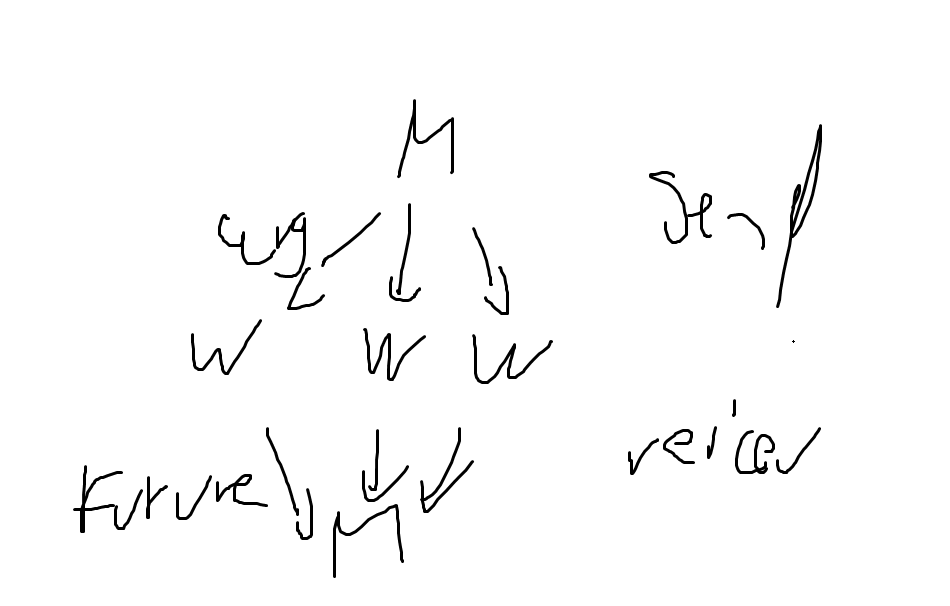
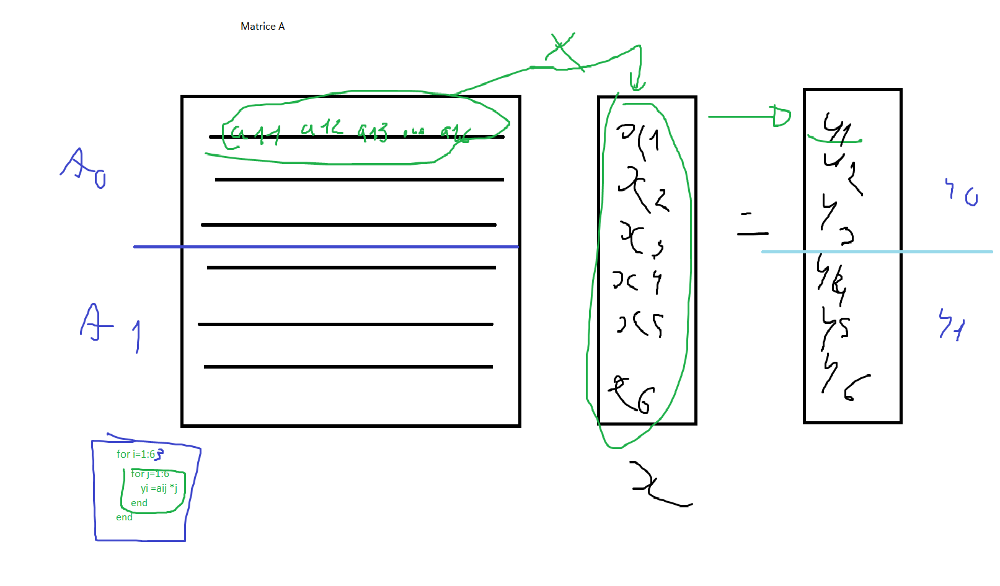

## Prequel
### Configuration matérielle :
L'intégralité des données utilisées pour illustrer les principes abordés par ce rapport proviennent de mon ordinateur portable. Les composants pouvant changer d'une machine à l'autre, il est donc important de préciser les spécificités de ma configuration locale.
 - **CPU** : Intel Core i5-11400H @ 2.70GHz
 - **GPU** : 4095MB NVIDIA GeForce RTX 3050 Laptop GPU
 - **RAM** : 32,0 Go 3200 MHz
 - **Carte mère** : ASUSTeK COMPUTER INC. FX506HCB (U3E1)
 - **Stockage** : 476GB NVMe INTEL SSDPEKNU512GZ (RAID (SSD))

### Informations :
Afin d'améliorer la qualité du rapport, j'ai utilisé des outils d'IA générative pour réduire les fautes et mieux comprendre certaines notions.

## Introduction

Ce cours à pour but d'illustrer la méthode de Monte-Carlo (faisant référence au casino de Monte-Carlo). L'objectif de cette algorithme probabiliste est de calculer une approximation de π. 


<!-- Todo: Pour se faire nous allons utiliser mémoire partagée/distribuée et M/W afin de faire des test sur la scalabilité? -->
<!-- Todo: Dire sa norme aussi ==> conformiser a sa norme -->

## Sommaire :
<!-- TODO : à la fin -->
## I/ Généralités


<!-- TODO: parler des scalabilité forte etc en mode ca c une intro? -->

L'expérimentation se base sur la génération aléatoire de points dans un carré de côté 1 et la détection de ceux qui tombent dans le quart de disque inscrit. Le nombre de points valides et le nombre total permettent d'estimer la valeur de π.


**Figure 1 :** Illustre le tirage aléatoire de points xi de coordonnées(xi,yi) où xi et yi suivent une loi U (]0,1[]). La probabilité qu'un point Xi soit dans le quart de disque est telle que :


### 1. Définition des aires :

Soit un **carré de côté 1** et un **quart de disque de rayon 1** :  
- $\text{Aire du carré} = r^2 = 1 $
- $\text{Aire du quart de disque} = \frac{\pi \times r^2}{4} = \frac{\pi}{4}$

### 2. Probabilité qu'un point soit dans le disque :

$$ \text {On tire aléatoirement des points } ( (x_i, y_i) ) \text { qui suivent une loi uniforme (U(0, 1)) représentant les cordonnées d'un point}$$

$$ \text {La distance d'un point } ( (x_p, y_p) ) \text { à l'origine est donnée par }$$ 
$$d = \sqrt{x_p^2 + y_p^2}$$

La condition pour qu'un point soit dans le quart de disque est : $$d \leq 1 $$


### 3. Calcul de la probabilité :

$$ \text {La probabilité qu'un point } ( X_i ) \text { soit dans le quart de disque est : }$$ 
$$ P(X_i / d_i < 1) = \frac{\text{Aire du quart de disque}}{\text{Aire du carré}} = \frac{\pi}{4}$$


### 4. Calcul de π
On effectue **n tirages** aléatoires

$$\text{Si } ( n_{\text{total}} ) \text{ est grand, alors on approche :} $$
$$P(X_i / d_i < 1) \approx \frac{n_{\text{cible}}}{n_{\text{total}}} $$
$$ \text{où } ( n_{\text{cible}} ) \text{ est le nombre de points dans la cible (quart de disque).}$$

On peut alors approcher π par :
$$ \pi \approx 4 \times \frac{n_{\text{cible}}}{n_{\text{total}}}$$


## II/ Algorithme et parallélisation
**Algo 1 : MonteCarlo**
```java
ncible = 0;
// generer/ compter ncible
for (i=0; i<ntotal; i++) {
        generer xi; // selon U(]0;1[)
        generer yi; // rand() ==> fonction random
        if xi**2 + yi**2 < 1 {
            ncible++
        }
}
// Calculer Pi
Pi = 4(ncible/ntotal);
```


# Cours 2 : Recuperer le cours de qqun car en retard d'une heure 
# 2 : Parallélisation :


Task Data / Data parallelisation : on choisit l'un des deux : Le task

1. Il sert à identifier des tâches
2. Décomposer ses tâches ==> en sous-tâches
3. Dépendances des tâches
4. ... ?

* refaire le schema de excalidraw en staruml
* bcp de truc sur excalidraw enft

Expliquer les "Future"
Futur ==> manière d'exprimer les dépendences entre les taches | d'un point de vue du code, la tache renvoie un résultat qu'on vient récupérer à un moment dans le code et c'est à ce moment qu'on va synchroniser.


Cours 3 :

mentionner : Bibliotheque openMP ==> pour faire de la programmation en mémoire partagée 

Expliquer latomique
Atomique (Atomique Integer) ==> Un objet qui protège un entier. Et cet objet pour pouvoir le modifier ya des points d'entrés genre `getAndIncrement`

---- 

La métrique qui nous intéresse : Speed-up (Accélération)
- CM4 Slide 15 (formule)

C'est quoi un speedup linéaire ?
Speedup linéaire 
* ==> si je mets 2 processus je vais 2 plus vite 
* ==> si je mets p processus je vais p fois plus vite 

Compléxité linéaire ==> Complexité de O(n)


Ca s'apelle strong scalability ==> scalabilité forte : essaie de suivre le speedup linéaire comme il peut : “Est-ce que je vais plus vite quand j’ajoute des processus ? ”
==> l'axe O est pas = 0 mais 1 et le "Négatif" c'est entre 0 et 1. ==> refaire le schéma
==> regarde en vrai dans le cours ya une definition
Montrer que le code suit cette courbe ==> Si le code se rapproche du speedup linéaire ==> "on a ca c gagner"

TODO : Je voulais dire quoi?
Le négative ==> Le temps Tp est supérieur au temps T1 ==> on passe plus de temps a calculer/resoudre dependances faire les commuications que quand on était en séquentiel.

**Parler de STEALING POOL dans le cours 2** ==> jai 1million de tache et 2 processus. j'ai un algo qui associe les tache aux deux processus aux un puis aux autres...
Le Work stealing pool ==> arrive + ou - a caller la moitier sur un processus et lautre moitié sur l'autre

ntot/p +3/ntot ==> je sais pas c quoi [ajouter des bails sah jsp] ==> TODO : cf LOAN prends 75%

Parallelisme car probleme trop gros.

On va changer la masse de travail globale (?) pour un processus, et donc 

"Si vous avez ces deux trucs (weak scaling) et jsp ==>vous avez un code parrallele"

(A caller plus tot, explication stealing pool)
```ex :
p = 1    ntot #nombre d'itérations
p = 2    ntot/2 #Itérations gérée par un processus
p        ntot/p

temps d'éxécution
t1 =
t2 = ntot /2
tp = ntot/p
Sp = t1/tp

Hyp: Chaque itération s'éxécute en un temps fixe ti

-------
Itération parallèle V1

p = 1    ntot #nombre d'itérations
p = 2    ntot/2 #Itérations gérée par un processus
...
p        ntot/p + 3/4 ntot (graphique 75% tombe dans l'arc de cercle)

Hyp: Chaque itération s'éxécute en un temps fixe ti
=> tp>t1
Sp = t1/tp <1

-------
Itération parallèle V2

p = 1    ntot #nombre d'itérations
p = 2    ntot/2 #Itérations gérée par un processus
...
p        ntot/p + 1/4 ntot (graphique 25% tombe en dehors de l'arc de cercle)
Hyp: Chaque itération s'éxécute en un temps fixe ti

=> tp<t1
Sp = t1/tp <1
```


FAIRE LE TP :
1/ Executer et passer les parametres a l'executable

**Pi output:**
```
Pi : 3.1412240000000002
Error: 1.1734608220821678E-4

Ntot: 500000
Available processors: 10
Time Duration (ms): 39

1.1734608220821678E-4 500000 10 39
total from Master = 392653

Process finished with exit code 0
```
**Assignment102 output:**
```
Approx value:3.14216
Difference to exact value of pi: 5.673464102069481E-4
Error: 0.018059197125975587 %
Available processors: 12
Time Duration: 17ms
```
2/ Avoir les mêmes sorties pour les 2 codes
Err relative |pi-π|/π


# askip fallait mettre de plus en plus de processeur et ca allait moins vite plus on en mettait

3/ Speedup "grossier"

# 17/01 -
Ce qu'on fait ca fonctionne que en architecture de mémoire partagée


En partagée faire ces schéma:
En Master-Worker ( faire un schéma en mode rond "M" qui sors 3 fleches vers 3 ronds "W0,w1,w2" Sur les flèche écrire "arg" dessus. Des workers 1 fleche repart vers! un nouveau rond master "m" avec comme label Future.get) => on fera ca dans le s semaines qui viennent


En mémoire distribuée :
Le même schéma sauf que sur les flèches 1 : "Send via réseau" et flches 2 : "recieved via réseau"

(faudra enlever le send/recieved pour le 1er schéma )


La quesiton : Comment on fait pour évaluer la qualité des codes parallèles.
- Effectiveness : /!\ trouver
- Efficiency : est-ce que je le fais, mais vite ? 

Time behavior & ressource utilisation ==> criteres de qualité : Ok comment j'utilise les ressources ?estce que je fvais vite etc..

Mesure de performance qui permettra d'évaluer les codes qu'on a fait en TP : "Donc on va faire ca" il a dit

Il reste 3 séances de Qdev :
- Ajrdhui mettre en place les code pour les comprendre / évaluer et commencer à faire programmation distribuée
- La fois d'apres on continue de programmé, peut  etre mettre en place le déploiement du code sur l'ensemble des postes | Si on va assez vite on refait la même en python au lieu de java pour mieux comprendre. Bibliotheque : MPI "Message Passing Interface" ==> bibliotheque denvoie de message ==> send / recieve

==> finir le TP4 jsp ce qui faut faire sah

La on parle d'acceleration : p15 - cm4 complement parallelisation en ajva

Sur la base de la p15 : Cette métrique dépend de ce qu'on mesre, si la charge de processus est a meme on veut qque T1 se rapproche de Tp
- Scalabilité forte : Code qui accelere
- Scalabilité faible : Code qui tient la charge

p16 : La courbe linéaire est Sp = p (je sais pas quo faire de l'info)
Parallele speedup = Sp | Processus (?)
Le schéma c ceui de la scaabilité forte en
Le régime linéaire c ce qu'on cherche : Je met p processus, je vais p*plus vite
Mais on aura un typicla succcess je crois.
La premiere chose qu'on voit c que y'a un écart entre linear et typical success ==> cet écart est du au temsp de communicatio netnrer processus et la gestio ndes processus (communicaion de l'OS, placement des processus sur la ressource). Forcement y'a un overhead (temps supplémentaire) qui "pèse" et fait augmenter le temps des processus. Cet écart va s'aggrandir, plus il y aura de processus.
A un moment si ya trop de processus la courbe typical success stagnera, voir s'écrouilera ==> moins performante quoi elle repart en bas.


POurrait etre une question d'examen : refais l'image au prorpe

Les "sous taches" sur cette image c'est le 2eme for jusqu'au **end** Tu l'encadreras sur le schéma (en gros encadtre les 3 dernieres lignes en bas de la matrice)
(dailleurs y'a un autre end aussi en bas de boucle pour fermer le deuxieme i in range)

Le probleme matrice ...(jai zappé un truc la)
## Rien a voir mais regarde les photo du 29 novembre ya un truc a refaire.


La on va passer a la programation en mémoire distribuée. (a lancienne vu qu'en mémoire partagée ct moins performant : contraintes : java avec l'api concurrent et autre chose que j'ai zappé). mtn on change la containte sur la mise en oeuvre, le code plus en mémoir epartagée mais distribuée.
# Tp4 suite socket 
Regarder photo 17-01 vers 10h ==> On veut programmer la photo en java en gros

Les sockets que je vais crééer sont des objets avec des paquetes deb its :
- Adresse
- Flux d'entrée
- Flux de sosrtie
C'est un fichier a vec une adress ip et un port et un flux d'entrée/sortie.
} ==> flux d'entrée : inputStreal | fflux de sortie : outputStream

Donc la on bascule dans Tp4_Suite (repertoire)
IL FAUT FAIRE UN PEU UN COURS SUR LES SOCKETS DANS LE RAPPORT.
Rapport qui est un peu le cours.

Mais avant tout : faire l'uml ==> sur excalidraw la

# Cours sur les sockets :
Qu'est-ce que c'est ? : 
C'est un point de communication qui permet d'établir une communication :
- entre deux machines
- un processus sur un réseau

==> C'est un peu leur DM

Il y a toujours un socket qui sert de
- server et qui sera à l'écoute des connexions entrante.
- client et qui initie la connexion


Ils communiquent en utilisant les protocoles TCP (Transmission Control Protocol) / UDP (User Datagram Protocol)
==> La connexion la plus safe est la TCP


# 27-01 - Faire des tests sur le tp4 avec pi etc..

on change le nb de processus et de points ==> peut être prouver qu'au bout d'u certain nombre ca sers a rien c trop rapide il capte pas.

Faut faire un graphique comme ya la courbe chelou là pour pouvoir interpreter apres les "lregimes de scalabilité"

Faudrait spliter aussi les classes à la con psk il fait chauffer


# 29-01 : 
Code en mémoire partagé avec la classe Pi.

Askip parallelisation de montecarlo

Exam : Donne un algo et savoir l'analyser

2 :Analyse de code existant : Assignement102 (itération parallele) par rapport a l'api concurrent keskel utilise PiMonteCarlo
3 : Comment est implémenté (?)

# 4: maintenant : sur pi.java ==> faire expérience 
La on est en mémoire partagée hein juste pour rappeler ca peut etre utile pour contraster avec la suite en mémoire distribuée
Changer le total count et le nombre de workers
- A1 : evaluation des performances de pi.java
- A2 : Scalabilité forte : c bon
- A3 : Scalabilité faible : une ligne proche de 1 askip sur le graphe de base comme la forte et la non statique pas en pointillées, elle tombe vers 0.8
- B1 : La même pour assignement102 :


5 : L8er ==> implémentation en mémoire distribuée

1. Variation du nombre d'itérations :

Pi.java ==> parralele
Assignement12 ==> pas parallele, ne scale pas, le temps passé dans les sectiosn critiques est trop importante et tout le temps passé dans les parrelelisation est gommé a cause de ca.


On a des arguments théoriques et pratiques (expérience) pour prendre pi.java


La question : est-ce que ca vaut le cout dintegrer pi dans workersocket?


> demande a chat gpt de le noter le rapport a la fin d ailleurs ca peut etre bien


!!! FAIRE une analyse des classes que ce soit dnas les fichiers et dans le rapport. Comme dhab préciser que t'as utilisé chatgpt

Parler dans le rapport qu'on a changé la config tu sais des masterworker comme ca t"explique tt c ce quil demande de toute facon. DOnc expliquer ca qui est un peu technqiue en vif

Dire que j'ai fais le script start_worker.bat psk sayer lancer quand ca buggait ca me rendais fou mgl

Scalabilité forte ==> si on arrive d'aller plus vite en augmentant les ressource
faible ==> si on arrive a traiter des pb plus gros en montant le nombre de processus et leur charge


Faire avec master socket inscrire les stats tas capté pour faire les graphs


Lundi : evaluatin ASSINGMENT 102

