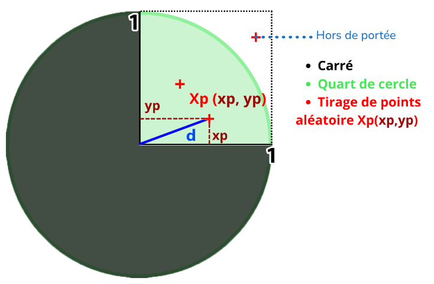
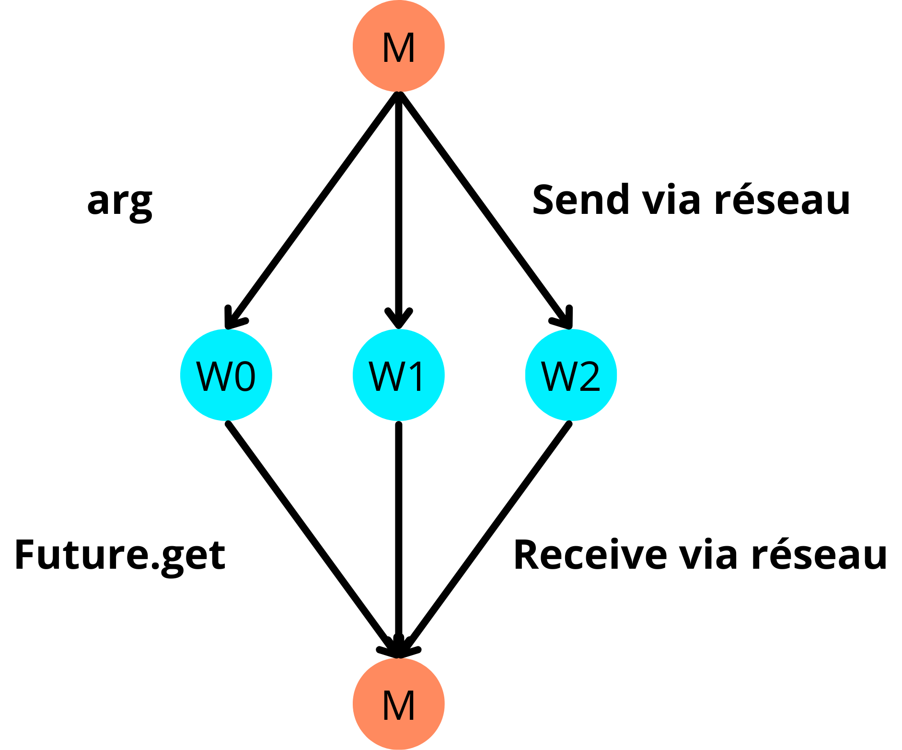

> Rédacteur : Florian DE SOUSA INFO3-FA

> Matière : Programmation Avancée
>
> Professeur : Thomas Dufaud (thomas.dufaud@uvsq.fr)

Afin d'améliorer la qualité du rapport, j'ai utilisé des outils d'IA générative pour réduire les fautes et mieux comprendre certaines notions.

# Introduction

Ce cours a pour but de tester les performances du **parallélisme** avec deux architectures à **mémoire partagée** : **Pi** & **Assignment102**. Ainsi qu'une architecture à **mémoire distribuée** : **Master/Worker Socket**, que nous allons approfondir en l'utilisant sur plusieurs machines lors de la dernière séance.

Pour ce faire, nous allons utiliser la méthode de **Monte-Carlo**, en référence au casino éponyme de Monte-Carlo. L'objectif de cet algorithme probabiliste est de calculer une approximation de π.

Nous étudierons ici la **scalabilité** apportée par le parallélisme de chacune des paradigmes ainsi que leur positionnement sur la norme **ISO 25010**.
# Sommaire :
<!-- TODO : à la fin -->

# I/ Définitions
## 📄 Norme ISO 25010
La norme ISO/IEC 25010 fait partie de la famille SQuaRE (Software Quality Requirements and Evaluation), qui définit un cadre pour spécifier et évaluer la qualité des logiciels et des systèmes informatiques. Ce cadre fournit des modèles clairs et normalisés pour garantir une évaluation cohérente et précise.

Cette norme propose deux modèles de qualité pour évaluer un produit logiciel ou système informatique. Ces modèles sont complémentaires et permettent d'analyser la qualité d'un produit sous deux angles différents.

### 🧑‍💻 Quality in Use Model (Qualité en utilisation)
**Objectif** : Évaluer l’interaction entre l’utilisateur et le produit dans un contexte d’utilisation spécifique. Ce critère est évalué avec 5 caractéristiques :

| **Caractéristique**                            | **Sous-caractéristiques**                                                                                                                                                                                                                                                                                                | **Description**                                                                                              | **Exemple**                                                                                                         |
|------------------------------------------------|--------------------------------------------------------------------------------------------------------------------------------------------------------------------------------------------------------------------------------------------------------------------------------------------------------------------------|--------------------------------------------------------------------------------------------------------------|---------------------------------------------------------------------------------------------------------------------|
| **Effectiveness** : Efficacité                 |                                                                                                                                                                                                                                                                                                                          | Mesure la capacité du produit à atteindre les objectifs de l'utilisateur.                                    | Une application de messagerie en ligne permet à l'utilisateur de communiquer rapidement et sans erreur.             |
| **Efficiency** : Efficience                    |                                                                                                                                                                                                                                                                                                                          | Évalue la capacité du produit à fournir des résultats optimaux avec une utilisation minimale des ressources. | Une application de traitement de texte consomme peu de mémoire tout en offrant une performance fluide.              |
| **Satisfaction** : Satisfaction                | - **Usefulness (Utilité)** : Réponse du produit aux besoins de l’utilisateur. <br>- **Trust (Confiance)** : Fiabilité et sécurité du produit. <br>- **Pleasure (Plaisir)** : Expérience positive de l’utilisateur. <br>- **Comfort (Confort)** : Ergonomie et confort physique/mental.                                   | Mesure le degré de satisfaction des utilisateurs lors de l'utilisation du produit.                           | Une application mobile bien conçue offre une interface fluide, sécurisée, et agréable à utiliser.                   |
| **Freedom from Risk** : Absence de risque      | - **Economic risk mitigation (Risques économiques)** : Coûts liés à l’utilisation du produit. <br>- **Health and safety risk mitigation (Risques de santé)** : Risques pour la santé et la sécurité de l’utilisateur. <br>- **Environmental risk mitigation (Risques environnementaux)** : Risques pour l’environnement. | Mesure la capacité du produit à minimiser les risques pour l’utilisateur.                                    | Un produit alimentaire indique clairement les risques d’allergènes, assurant la sécurité de l'utilisateur.          |
| **Context Coverage** : Couverture contextuelle | - **Context completeness (Complétude)** : Fonctionnement optimal sur divers systèmes ou configurations. <br>- **Flexibility (Flexibilité)** : Adaptation à des besoins ou scénarios variés.                                                                                                                              | Évalue la capacité du produit à s’adapter à différents environnements ou situations d'utilisation.           | Une application de navigation offre des options de personnalisation pour s'adapter à différents modes de transport. |

### 🛠️ Product Quality Model (Qualité du produit)
**Objectif** : Évaluer les propriétés internes et externes du produit. Ce critère est évalué avec 8 caractéristiques :

| **Caractéristique**                                      | **Sous-caractéristiques**                                                                                                                                                                                                                                                                                                                                                                                                                                                                                                                                                                                                                                                                                               | **Description**                                                                                   | **Exemple**                                                                                                 |
|----------------------------------------------------------|-------------------------------------------------------------------------------------------------------------------------------------------------------------------------------------------------------------------------------------------------------------------------------------------------------------------------------------------------------------------------------------------------------------------------------------------------------------------------------------------------------------------------------------------------------------------------------------------------------------------------------------------------------------------------------------------------------------------------|---------------------------------------------------------------------------------------------------|-------------------------------------------------------------------------------------------------------------|
| **Functional Suitability** : Adéquation fonctionnelle    | - **Functional completeness** (Complétude fonctionnelle) : Mesure de la couverture totale des fonctionnalités spécifiées. <br> - **Functional correctness** (Correction fonctionnelle) : Capacité à réaliser les fonctionnalités de manière correcte. <br> - **Functional appropriateness** (Pertinence fonctionnelle) : Pertinence des fonctionnalités par rapport aux besoins des utilisateurs.                                                                                                                                                                                                                                                                                                                       | La capacité du produit à fournir les fonctionnalités spécifiées et attendues.                     | Un logiciel de traitement de texte qui permet de créer, éditer et sauvegarder des documents.                |
| **Performance Efficiency** : Efficacité des performances | - **Time behaviour** (Comportement temporel) : Temps d'exécution des opérations ou des processus. <br> - **Resource utilization** (Utilisation des ressources) : Efficacité de l'utilisation des ressources disponibles, comme la mémoire et le processeur. <br> - **Capacity** (Capacité) : Capacité du produit à gérer de grandes quantités de données ou d'utilisateurs.                                                                                                                                                                                                                                                                                                                                             | L'utilisation optimale des ressources et la vitesse d'exécution.                                  | Un jeu vidéo qui fonctionne sans ralentissements même avec une forte charge graphique.                      |
| **Compatibility** : Compatibilité                        | - **Co-existence** (Coexistence) : Capacité à fonctionner avec d'autres produits ou systèmes sans interférence. <br> - **Interoperability** (Interopérabilité) : Capacité à échanger des informations avec d'autres systèmes sans perte ou altération.                                                                                                                                                                                                                                                                                                                                                                                                                                                                  | La capacité à fonctionner avec d’autres systèmes ou produits sans interférence.                   | Une application mobile qui fonctionne sur iOS et Android.                                                   |
| **Usability** : Utilisabilité                            | - **Appropriateness recognizability** (Pertinence reconnaissance) : Facilité avec laquelle l'utilisateur reconnaît la pertinence des fonctions. <br> - **Learnability** (Apprentissage) : Facilité d’apprentissage du produit. <br> - **Operability** (Exploitation) : Facilité d’utilisation du produit dans des situations réelles. <br> - **User error protection** (Protection contre les erreurs utilisateur) : Mécanismes de protection contre les erreurs. <br> - **User interface aesthetics** (Esthétique de l'interface utilisateur) : Qualité visuelle de l'interface. <br> - **Accessibility** (Accessibilité) : Facilité d'accès pour tous les utilisateurs, y compris ceux ayant des besoins spécifiques. | L'ergonomie et la facilité d’utilisation du produit.                                              | Une interface utilisateur simple et intuitive pour une application bancaire en ligne.                       |
| **Reliability** : Fiabilité                              | - **Maturity** (Maturité) : La stabilité et l'absence de bogues dans le produit. <br> - **Availability** (Disponibilité) : Le temps pendant lequel le produit est opérationnel et accessible. <br> - **Fault tolerance** (Tolérance aux pannes) : Capacité du produit à continuer à fonctionner après une défaillance. <br> - **Recoverability** (Récupérabilité) : La capacité du produit à se remettre rapidement d'une défaillance.                                                                                                                                                                                                                                                                                  | La capacité du produit à fonctionner de manière stable et prévisible dans le temps.               | Un serveur web qui fonctionne 24/7 avec des interruptions minimales.                                        |
| **Security** : Sécurité                                  | - **Confidentiality** (Confidentialité) : Protection des données contre l'accès non autorisé. <br> - **Integrity** (Intégrité) : Protection contre la modification non autorisée des données. <br> - **Non-repudiation** (Non-répudiation) : Garantie que les actions effectuées ne peuvent pas être niées. <br> - **Accountability** (Responsabilité) : Suivi des actions réalisées pour identifier les responsables. <br> - **Authenticity** (Authenticité) : Vérification de l'identité des utilisateurs et des données.                                                                                                                                                                                             | La protection contre les risques d’accès non autorisé et de manipulation des données.             | Un site de commerce en ligne utilisant le chiffrement SSL pour les paiements.                               |
| **Maintainability** : Maintenabilité                     | - **Modularity** (Modularité) : Divisibilité du produit en modules indépendants. <br> - **Reusability** (Réutilisabilité) : Facilité avec laquelle les composants peuvent être réutilisés. <br> - **Analysability** (Analyzabilité) : Facilité d'analyse du produit pour en comprendre le fonctionnement. <br> - **Modifiability** (Modifiabilité) : Facilité avec laquelle le produit peut être modifié pour ajouter de nouvelles fonctionnalités ou corriger des erreurs. <br> - **Testability** (Testabilité) : Capacité à tester efficacement le produit pour vérifier son bon fonctionnement.                                                                                                                      | La capacité du produit à être modifié, corrigé ou amélioré efficacement après sa mise en service. | Un logiciel avec un code propre et bien documenté, permettant des mises à jour régulières sans difficultés. |
| **Portability** : Portabilité                            | - **Adaptability** (Adaptabilité) : Capacité à s'adapter à différents environnements. <br> - **Installability** (Installabilité) : Facilité d'installation sur différentes plateformes. <br> - **Replaceability** (Remplaçabilité) : Capacité à être remplacé par une autre version ou un produit similaire sans perte de fonctionnalités.                                                                                                                                                                                                                                                                                                                                                                              | La capacité à fonctionner dans différents environnements ou à être facilement déplacé.            | Un programme compatible avec Windows, Mac et Linux.                                                         |

## 🧠 Mémoire
La mémoire **RAM** (Random Access Memory) permet à l'ordinateur de stocker temporairement les **données** et **instructions** des programmes en cours d’exécution dans des zones de mémoires.
### 🔗 Mémoire partagée
La mémoire partagée est un modèle où plusieurs **processus** accèdent directement à une même zone de **mémoire physique**. Ils peuvent **lire** et **écrire** dans cet espace commun, facilitant un échange rapide de données. Cette notion nécessite de revoir le précédent rapport dans lequel nous étudions la notion de **verrou MUTEX** qui permet de s'assurer de **l'intégrité des données partagées**.
### 📡 Mémoire distribuée
La mémoire distribuée est un modèle où chaque **processus** accède uniquement à sa **propre zone de mémoire**. La communication entre les processus se fait par **échange de messages**, nous retrouvons en général **un récepteur** et **plusieurs émetteurs**.
## ⚡ Parallélisation
La parallélisation consiste à diviser une **tâche complexe** en **sous-tâches**. Elles peuvent être ensuite être exécutées en **parallèle** afin d'accélérer la tâche complexe en utilisant le **maximum de ressources locales**. Ce processus d'exécution simultanée des sous-tâches est appelé d'exécution simultanée des sous-tâches est appelé **parallélisme**. Il s'oppose à la notion de **séquentiel/itération**, qui se contente d'exécuter simplement les tâches les unes après les autres.

## 📈 Scalabilité
La scalabilité désigne la capacité d’un système, d'une application ou d'une infrastructure à s'**adapter à l'augmentation de la charge de travail** ou à **l'extension de ses ressources** sans perdre en performance ou en efficacité.
### 🚀 Scalabilité forte
La scalabilité forte est la capacité d'un système à **augmenter sa performance** en fonction du nombre de ressources allouées. Pour la mesurer, on divise la **charge initiale** par le **nombre de ressources**.

On peut la mesurer avec cette formule :

$$\text{Scalabilité forte = }\frac{\text{Charge initiale}}{\text{Nombre de ressources}}$$

Pour mesurer l'amélioration des performances, on utilise aussi le **speedup** qui se calcule ainsi :

$$S(p) = \frac{T(1)}{T(p)}$$

* **T(1) :** le temps d'exécution du programme avec 1 seul processeur.
* **T(p) :** le temps d'exécution avec \( p \) processeurs.

Le **speedup linéaire** représente le gain de performance idéal et s'exprime par la formule :

$$S(p) = p$$

La **scalabilité forte** tente de se rapprocher de ce speedup linéaire. Dans un système parfait, le temps d'exécution diminue proportionnellement au nombre de ressources allouées, ce qui signifie que si j'ajoute **p** fois plus de ressources, je devrais aller **p** fois plus vite.

Son objectif est de vérifier si le système peut **réduire le temps d'exécution** en **augmentant le nombre de ressources allouées**.

#### 📄 ISO 25010
La scalabilité forte permet de valider les critères **Performance Efficiency (Efficacité des performances)**, **Reliability (Fiabilité)** et **Maintainability (Maintenabilité)** du modèle de qualité du produit ISO 25010.
### 🐢 Scalabilité faible
La scalabilité faible est la capacité d'un système à **maintenir une performance stable** malgré l'augmentation de la charge, en ajoutant proportionnellement des ressources.

Pour la mesurer, on multiplie la **charge initiale** par le **nombre de ressources** :

$$\text{Scalabilité faible = Charge initiale } \times \text{ Nombre de workers}$$

Généralement, on vient comparer cette métrique avec une **constante**, qui représente une performance idéale ou de référence pour le système. Cette constante est égale à **1**, signifiant que l'ajout de ressources ne dégrade ni n'améliore la performance globale, mais maintient la même performance quel que soit le nombre de ressources allouées. En d'autres termes, la charge est distribuée de manière optimale entre les ressources sans perte d'efficacité.

De plus, dans un système bien conçu, la seule opération potentiellement coûteuse est la gestion de la ressource critique qui cumule les résultats. Toutefois, cette opération devient négligeable lorsque les tâches sont correctement réparties entre les ressources.

Son objectif est de vérifier si le système peut **absorber une charge croissante sans dégrader la vitesse d'exécution globale**.
#### 📄 ISO 25010
La scalabilité faible permet de valider les critères **Performance Efficiency (Efficacité des performances)**, **Reliability (Fiabilité)** et **Maintainability (Maintenabilité)** du modèle de qualité du produit ISO 25010.
# II/ Monte-Carlo
Il est maintenant important de présenter ce qu'est l'algorithme de Monte-Carlo, car nous allons comparer plusieurs implémentations de cet algorithme dans les architectures à mémoire partagée et distribuée.

L'expérimentation se base sur la génération aléatoire de points dans un carré de côté 1 et la détection de ceux qui tombent dans le quart de disque inscrit. Le nombre de points valides et le nombre total permettent d'estimer la valeur de π.

**Figure 1 :** Illustre le tirage aléatoire de points xi de coordonnées (xi, yi) où xi et yi suivent une loi U (]0,1[]). La probabilité qu'un point Xi soit dans le quart de disque est telle que :


## 1. Définition des aires :

Soit un **carré de côté 1** et un **quart de disque de rayon 1** :
- $\text{Aire du carré} = r^2 = 1 $
- $\text{Aire du quart de disque} = \frac{\pi \times r^2}{4} = \frac{\pi}{4}$

## 2. Probabilité qu'un point soit dans le disque :

$$ \text {On tire aléatoirement des points } ( (x_i, y_i) ) \text { qui suivent une loi uniforme (U(0, 1)) représentant les cordonnées d'un point}$$

$$ \text {La distance d'un point } ( (x_p, y_p) ) \text { à l'origine est donnée par }$$
$$d = \sqrt{x_p^2 + y_p^2}$$

La condition pour qu'un point soit dans le quart de disque est : $$d \leq 1 $$

## 3. Calcul de la probabilité :

$$ \text {La probabilité qu'un point } ( X_i ) \text { soit dans le quart de disque est : }$$
$$ P(X_i / d_i < 1) = \frac{\text{Aire du quart de disque}}{\text{Aire du carré}} = \frac{\pi}{4}$$

## 4. Calcul de π
On effectue **n tirages** aléatoires

$$\text{Si } ( n_{\text{total}} ) \text{ est grand, alors on approche :} $$
$$P(X_i / d_i < 1) \approx \frac{n_{\text{cible}}}{n_{\text{total}}} $$
$$ \text{où } ( n_{\text{cible}} ) \text{ est le nombre de points dans la cible (quart de disque).}$$

On peut alors approcher π par :
$$ \pi \approx 4 \times \frac{n_{\text{cible}}}{n_{\text{total}}}$$

# III/ Différents paradigmes de programmation
## 1. Algorithme séquentiel
```java
ncible = 0;
ntotal = 1200000;
// T1
for (i=0; i<ntotal; i++) {
        xi = Math.random();
        yi = Math.random();
        // T2
        if xi**2 + yi**2 < 1 {
            ncible++
        }
}
// T3
Pi = 4(ncible/ntotal); 
```
- Tache 1 : Générer des points aléatoires dans le carré
- Tache 2 : Compter le nombre de points dans le quart de disque
- Tache 3 : Calculer π

Le problème que rencontre cet algorithme est qu'il est **séquentiel**. On est limité, car on peut tirer les points qu'un à la fois. Cela peut être long si le nombre de points est très grand. Il n'offre aucune possibilité de parallélisation.
## 2. Algorithme parallèle
```java
ntotal = 1200000;
AtomicInteger ncible = new AtomicInteger(0);
ExecutorService executor = Executors.newFixedThreadPool(Runtime.getRuntime().availableProcessors());
// T1
for (int i = 0; i < ntotal; i++)
    executor.execute(() -> {
        double xi = Math.random(); 
        double yi = Math.random();
        // T2
        if (xi * xi + yi * yi <= 1)
            ncible.incrementAndGet();
    });
executor.shutdown();
while (!executor.isTerminated()) {
}
//T3
Pi = (4.0 * ncible.get() / ntotal);
```
- Tache 1 : Générer des points aléatoires dans le carré
- Tache 2 : Compter le nombre de points dans le quart de disque
- Tache 3 : Calculer π

On retrouve les mêmes précédentes tâches, sauf que les tâche 1 et 2 sont parallélisées. Chaque point est traité par un thread différent, ce qui permet de gagner du temps. On utilise ici un **AtomicInteger** en tant que verrou MUTEX pour éviter les problèmes de **synchronisation**, car **ncible** est une ressource critique.
## 3. Master/Worker
L’architecture Master/Worker est similaire à la programmation parallèle, cependant elle a un avantage majeur.

Chaque Worker peut travailler avec ses propres variables locales. Cela réduit les conflits, car les Workers n’ont pas besoin de se synchroniser constamment pour accéder à des ressources partagées. Ce qui permet d'obtenir une meilleure scalabilité.

De plus, la modularité de cette architecture permet d’aller encore plus loin, en exécutant les Workers sur différentes machines, ouvrant la porte à des systèmes distribués. C'est ce que nous allons étudier dans la suite de ce rapport.


**Figure 2 :** Illustration de l'architecture Master/Worker. Le Master envoie des tâches aux Workers qui les exécutent en parallèle. Les Workers renvoient les résultats au Master qui les fusionnent pour obtenir le résultat final.
### Sockets
Pour cette implémentation, nous allons utiliser des **sockets**. Les sockets sont des points de communication qui permettent d'établir une connexion entre deux machines ou un processus sur un réseau. Ils communiquent en utilisant les protocoles **TCP** (Transmission Control Protocol) ou **UDP** (User Datagram Protocol). La connexion la plus sûre reste la **TCP**. Ils sont définis à travers les ports de l'ordinateur.

On y retrouve un Socket **Server** (équivalent de Master), qui est à l'écoute des connexions entrantes, et un Socket **Client** (équivalent de Worker) qui initie la connexion.

# IV/ Études des implémentations
La plupart de ces implémentations utilisent l'**API Concurrent** de Java, qui permet de gérer plus facilement les threads et les ressources partagées. Cela permet de simplifier la gestion des ressources critiques et de la synchronisation.
## Configurations matérielles utilisées :
Les composants pouvant changer d'une machine à l'autre (et qui pourraient donner différents résultats), il est donc important de spécifier les configurations matérielles utilisées dans ce rapport.

| Composant      | Mon ordinateur portable                   | Ordinateur de l'Université (G26) |
|----------------|-------------------------------------------|----------------------------------|
| **CPU**        | Intel Core i5-11400H @ 2.70GHz            | Intel Core i7-7700 @ 3.60GHz     |
| **GPU**        | NVIDIA GeForce RTX 3050 (4GB)             | Intel HD Graphics 630            |
| **RAM**        | 32,0 Go 3200 MHz                          | 32,0 Go 2400 MHz                 |
| **Carte mère** | ASUSTeK COMPUTER INC. FX506HCB (U3E1)     | Dell 0PMYYJ                      |
| **Stockage**   | 476GB NVMe INTEL SSDPEKNU512GZ (RAID SSD) | SanDisk X400 2.5 7MM 512GB       |

## 1. Pi.java
Dans ce cadre-là, nous utilisons la mémoire partagée.

La spécificité de cette implémentation est qu'elle utilise les Futures, Threadpools et Callable de l'API Concurrent. Cela permet de gérer plus facilement les threads et les ressources partagées.
* Les **Futures** sont des objets représentant le résultat d'une opération asynchrone. Ils permettent de soumettre une tâche à exécuter par un autre thread et de récupérer le résultat une fois la tâche terminée, en bloquant si nécessaire jusqu'à ce que le résultat soit disponible. Cela facilite la gestion des threads et des ressources partagées (cf [Rapport1.md](Rapport1.md)).
* Les **Callables** sont des objets permettant de soumettre une tâche asynchrone qui retourne un résultat. Utilisés pour des calculs ou des opérations produisant une valeur, ils sont complémentaires aux Futures et facilitent la gestion des threads ainsi que des ressources partagées.
* Les **ThreadPools** sont des groupes de threads pré-instanciés, prêts à exécuter des tâches asynchrones. Ils permettent de gérer et réutiliser des threads, réduisant ainsi le coût de création et de destruction de threads à chaque nouvelle tâche. Leur utilisation optimise les performances et permet une gestion efficace des ressources. Dans notre cas, le ThreadPool va wrapper nos Workers.

### Structure UML de Pi.java


### Analyse de l'implémentation de Pi.java


- **Scalabilité Forte :** Les performances s'améliorent avec l'augmentation du nombre de cœurs (précisément lorsqu'on utilise 12 cœurs sur la config 'myLaptop'). Cependant, on constate que les courbes ont tendance à s'entremêler.
- **Scalabilité Faible :** Les performances restent stables lorsque le nombre de tâches et de travailleurs augmente proportionnellement, indiquant une bonne utilisation des ressources. Elles semblent tendre vers 0.8 tout au plus.

On remarque que malgré la hausse en charge les données "s'entremêlent", restent néanmoins très bonne. On peut donc conclure que cette implémentation à une excellente utilisation de ses ressources. Pi.java est **scalable**.

### Analyse des erreurs de Pi.java

- **Scalabilité Forte :** Les erreurs semblent diminuer avec l'augmentation du nombre de cœurs. Cependant, la médiane des points n'est pas parfaitement linéaire
- **Scalabilité Faible :** Les erreurs semblent diminuer avec l'augmentation du nombre de cœurs. Nous remarquons que la médiane des points est linéaire.

### Norme ISO 25010
**Performance Efficiency (Efficacité des performances) :**
- **Scalabilité Forte** : L'efficacité est bonne, elle semble s'améliorer avec l'augmentation du nombre de cœurs. Cependant, les courbes de scalabilité ont tendance à s'entremêler, ce qui peut indiquer une saturation des ressources. De plus, la variabilité des erreurs suggère que l'algorithme n'exploite pas toujours les ressources de manière optimale. Cela pourrait indiquer des inefficacités dans la parallélisation ou la gestion des ressources.
- **Scalabilité Faible** : L'efficacité est élevée, elle semble s'améliorer avec l'augmentation du nombre de cœurs. Plus la charge est élevée, plus les courbes de scalabilités convergent vers 1. De plus, les erreurs diminuent linéairemetn avec l'augmentation du nombre de cœurs, ce qui suggère une utilisation efficace des ressources.

**Reliability (Fiabilité) :**
- **Scalabilité Forte** : La fiabilité est modérée. Bien que les performances s'améliorent avec l'augmentation du nombre de cœurs, la variabilité des erreurs et l'entremêlement des courbes de scalabilité indiquent que les résultats ne sont pas toujours cohérents. Cela pourrait être dû à des problèmes de synchronisation ou à une gestion sous-optimale des ressources.
- **Scalabilité Faible** : La fiabilité est élevée. Les erreurs diminuent de manière linéaire et les performances restent stables, ce qui indique que l'algorithme est capable de fournir des résultats cohérents et prévisibles même lorsque la charge de travail est répartie sur plusieurs cœurs.

**Maintainability (Maintenabilité) :**
- **Scalabilité Forte** : La maintenabilité pourrait être affectée par la complexité de gestion des ressources et la variabilité des erreurs. Les ajustements fréquents nécessaires pour optimiser les performances en fonction du nombre de cœurs pourraient augmenter la complexité du code et rendre la maintenance plus difficile.
- **Scalabilité Faible** : La maintenabilité est bonne. La stabilité des erreurs et des performances suggère que l'algorithme est robuste et nécessite peu d'ajustements. Cela facilite la maintenance et les éventuelles modifications du code.

**Conclusion :**
- **Performance Efficiency (Efficacité des performances) :** L'efficacité des performances est élevée en scalabilité faible, avec une utilisation efficace des ressources et une diminution linéaire des erreurs. En scalabilité forte, bien que les performances s'améliorent, la saturation des ressources et la variabilité des erreurs indiquent des inefficacités potentielles.
- **Reliability (Fiabilité) :** La fiabilité est élevée en scalabilité faible, avec des résultats cohérents et prévisibles. En scalabilité forte, la fiabilité est modérée en raison de la variabilité des erreurs et des problèmes potentiels de synchronisation.
- **Maintainability (Maintenabilité) :** La maintenabilité est bonne en scalabilité faible, grâce à la stabilité des performances et des erreurs. En scalabilité forte, la complexité de gestion des ressources et la variabilité des erreurs pourraient rendre la maintenance plus difficile

## 2. Assignment102.java
Dans ce cadre-là, nous utilisons la mémoire partagée.

La spécificité de cette implémentation est qu'elle utilise **AtomicInteger* et **newWorkStealingPool** de l'API Concurrent. Ces outils permettent de gérer les threads et les ressources partagées de manière plus efficace dans un environnement parallèle.
* L'**AtomicInteger** est un type spécial d'entier qui permet d'effectuer des opérations atomiques. Cela signifie que les mises à jour de cette variable sont sécurisées contre les conflits entre plusieurs threads. Il s'agit d'un verrou MUTEX qui permet de gérer les ressources critiques.
* Le **newWorkStealingPool** est un type de ThreadPool qui utilise le mécanisme de vol de tâches (task stealing). Cela permet à un thread inactif de voler des tâches à un autre thread qui est plus occupé.
### Structure UML de Assignment102.java

### Analyse de l'implémentation de Assignment102.java


- **Scalabilité Forte :** Les performances ne décollent pas (myLaptop), voir se décroit (G24) avec l'augmentation du nombre de cœurs. On ne se rapproche pas du tout du speed up idéal qu'est le speedup linéaire.
- **Scalabilité Faible :** Les performances chutent avec l'augmentation du nombre de cœurs et convergent vers 0.

Cette implémentation ne respecte aucun critère de scalabilité. Ce code n'est pas **scalable** car il serait moins performant si l'on essaierait de multiplier le nombre de workers.

### Analyse des erreurs de Assignment102.java

- **Scalabilité Forte :** La répartition des points de médiane est assez chaotique, on n'y retrouve aucune linéarité. Malgré ça, les erreurs semblent tout de même diminuer avec l'augmentation du nombre de cœurs.
- **Scalabilité Faible :** Les erreurs semblent diminuer avec l'augmentation du nombre de cœurs. Nous remarquons que la médiane des points est linéaire. Mais tout de même moins précis que Pi.java.

### Norme ISO 25010

**Performance Efficiency (Efficacité des performances) :**
- **Scalabilité Forte** : L'efficacité est faible. Les performances ne décollent pas avec l'augmentation du nombre de cœurs, et on ne se rapproche pas du speedup linéaire idéal. Cela suggère que l'algorithme n'exploite pas les ressources de manière optimale, probablement en raison de goulots d'étranglement ou d'une mauvaise gestion de la parallélisation.
- **Scalabilité Faible** : L'efficacité est très faible. Les performances chutent avec l'augmentation du nombre de cœurs et convergent vers 0, ce qui indique que l'implémentation n'est pas capable de tirer profit des ressources supplémentaires. Cela pourrait être dû à une surcharge de communication entre les workers ou à une répartition inefficace des tâches.

**Reliability (Fiabilité) :**
- **Scalabilité Forte** : La fiabilité est faible. La variabilité des erreurs et l'absence d'amélioration des performances avec l'augmentation du nombre de cœurs suggèrent que les résultats ne sont pas cohérents. De plus, Assignment102 est moins précis que Pi.java, ce qui affecte la fiabilité des résultats. Cela pourrait être dû à des problèmes de synchronisation ou à une gestion sous-optimale des ressources.
- **Scalabilité Faible** : La fiabilité est faible. La chute des performances et la convergence vers 0 montrent que l'algorithme n'est pas fiable pour gérer une charge de travail répartie sur plusieurs cœurs. Les résultats ne sont pas prévisibles, et la précision est inférieure à celle de Pi.java, ce qui affecte la fiabilité globale.

**Maintainability (Maintenabilité) :**
- **Scalabilité Forte** : La maintenabilité est affectée par la complexité de gestion des ressources et la variabilité des erreurs. Étant donné la répartition chaotique des points de médiane et la stagnation des performances avec l'augmentation du nombre de cœurs (voir réduction avec les données obtenues en G24), des nombreux ajustements sont nécessaires pour optimiser les performances. Cela pourrait augmenter la complexité du code et rendre la maintenance plus difficile.
- **Scalabilité Faible** : La maintenabilité est faible. La chute des performances et la convergence vers 0 suggèrent que l'implémentation actuelle n'est pas robuste. Cela pourrait nécessiter des refontes majeures pour améliorer la gestion des ressources et la répartition des tâches, ce qui rendrait la maintenance plus complexe.

**Conclusion :**
- **Performance Efficiency (Efficacité des performances) :** L'efficacité des performances est faible, que ce soit en scalabilité forte ou faible. L'implémentation ne parvient pas à exploiter les ressources supplémentaires de manière optimale, et les performances chutent avec l'augmentation du nombre de cœurs.
- **Reliability (Fiabilité) :** La fiabilité est faible dans les deux cas de scalabilité. Les résultats ne sont pas cohérents, et l'algorithme est moins précis que Pi.java, ce qui affecte la fiabilité globale. Les performances sont imprévisibles et les résultats peu fiables.
- **Maintainability (Maintenabilité) :** La maintenabilité est faible en raison de la complexité de gestion des ressources et de la nécessité de refontes majeures pour améliorer l'efficacité et la fiabilité de l'implémentation. La maintenance serait plus difficile et nécessiterait des ajustements fréquents pour optimiser les performances.

## 3. Master/Worker Socket
Dans ce cadre-là, nous utilisons la mémoire partagée et distribuée.

Cette implémentation utilise des Sockets pour la communication entre le Master et les Workers. Dans un premier temps, les tests sont effectués sur un seul ordinateur, où le Master et les Workers partagent la mémoire de la machine. Ensuite, l'implémentation est étendue à plusieurs machines, où le Master utilise une mémoire partagée tandis que chaque Worker dispose de sa propre mémoire distribuée. Ils exécutent les tâches en parallèle et renvoient leurs résultats au Master, qui les fusionne pour obtenir le résultat final. Cette approche améliore la scalabilité et les performances.

(Par ailleurs, petite information inutile, mais j'ai créé le script **start_worker.bat** afin de pouvoir lancer les Workers plus rapidement. Cela m'a permis de gagner du temps lorsque je récupérais mes données.)

### Structure UML de Master/Worker Socket


### Analyse de l'implémentation de Master/Worker Socket


- **Scalabilité Forte :** Les performances s'améliorent avec l'augmentation de la charge initiale. Le plus on lui donne une charge importante, le meilleur sera sa scalabilité. Par extension, les courbes sont de plus en plus croissantes et se rapprochent du speedup linéaire en fonction de la charge et du nombre de ressources allouées.
- **Scalabilité Faible :** Tout comme la scalabilité forte, les performances s'améliorent avec l'augmentation de la charge initiale. Plus on lui donne une charge importante, le meilleur sera sa scalabilité. Les courbes sont de moins en moins décroissantes et se rapprochent de la constante.

On remarque que plus la charge est importante et que le nombre de processus est haut, le meilleur est la scalabilité. Cette implémentation à une bonne utilisation de ses ressources. WorkerSocket.java & MasterSocket.java sont **scalable**.

### Analyse des erreurs de MasterSocket.java / WorkerSocket.java

- **Scalabilité Forte :** Les erreurs semblent diminuer avec l'augmentation du nombre de cœurs. Cependant, la médiane des points n'est pas parfaitement linéaire, ce qui indique une certaine variabilité dans les résultats à la manière de Pi.java.
- **Scalabilité Faible :** Les erreurs semblent diminuer avec l'augmentation du nombre de cœurs. Nous remarquons que la médiane des points est linéaire. Cependant, Pi.java reste plus précis (du moins pour le nombre de cœurs que nous avons testé).

### Norme ISO 25010

**Performance Efficiency (Efficacité des performances) :**
- **Scalabilité Forte** : L'efficacité est bonne. Les performances s'améliorent avec l'augmentation du nombre de cœurs, et les erreurs diminuent de manière significative. Cependant, la variabilité des erreurs suggère que l'algorithme n'exploite pas toujours les ressources de manière optimale, ce qui pourrait indiquer des inefficacités dans la communication entre le Master et les Workers.
- **Scalabilité Faible** : L'efficacité est élevée. Les erreurs diminuent de manière linéaire, et les performances restent stables, ce qui indique une bonne utilisation des ressources. Cependant, la variabilité des erreurs montre qu'il y a encore des améliorations possibles dans la gestion des ressources.

**Reliability (Fiabilité) :**
- **Scalabilité Forte** : La fiabilité est modérée. Bien que les performances s'améliorent avec l'augmentation du nombre de cœurs. Cependant, plus la charge est élevée, plus la fiabilité s'améliore, car l'algorithme parvient à mieux répartir les tâches entre les Workers, réduisant ainsi les risques de goulots d'étranglement. Cela montre que l'implémentation est plus fiable lorsqu'elle est soumise à des charges importantes.
- **Scalabilité Faible** : La fiabilité est élevée. Les erreurs diminuent de manière linéaire, et les performances restent stables, ce qui indique que l'algorithme est capable de fournir des résultats cohérents et prévisibles même lorsque la charge de travail est répartie sur plusieurs cœurs. La stabilité des résultats est un indicateur fort de fiabilité.

**Maintainability (Maintenabilité) :**
- **Scalabilité Forte** : La maintenabilité pourrait être affectée par la complexité de gestion des ressources et la variabilité des erreurs. Les ajustements fréquents nécessaires pour optimiser les performances en fonction du nombre de cœurs pourraient augmenter la complexité du code et rendre la maintenance plus difficile.
- **Scalabilité Faible** : La maintenabilité est bonne. La stabilité des erreurs et des performances suggère que l'algorithme est robuste et nécessite peu d'ajustements. Cela facilite la maintenance et les éventuelles modifications du code.

**Conclusion :**
- **Performance Efficiency (Efficacité des performances) :** L'efficacité des performances est bonne en scalabilité forte et élevée en scalabilité faible. Les erreurs diminuent de manière significative avec l'augmentation du nombre de ressources et de la charge de travail, ce qui indique une bonne utilisation des ressources.
- **Reliability (Fiabilité) :** La fiabilité est modérée en scalabilité forte, mais s'améliore avec des charges plus élevées, car l'algorithme parvient à mieux répartir les tâches entre les Workers. En scalabilité faible, la fiabilité est élevée, avec des résultats cohérents et prévisibles.
- **Maintainability (Maintenabilité) :** La maintenabilité est bonne en scalabilité faible, mais pourrait être améliorée en scalabilité forte pour réduire la complexité de gestion des ressources.

### Expérience en G26
L'avantage qu'apporte l'implémentation Master/Worker Socket est qu'elle peut être étendue à plusieurs machines. Cela permet de répartir la charge de travail sur plusieurs machines, ce qui améliore la scalabilité et les performances. Pour tester cette fonctionnalité, nous avons lors de la dernière séance de TP, exécuté l'implémentation Master/Worker Socket sur plusieurs machines de la salle G24.

# V/ Conclusion


En interprétant le graphique visuellement, on peut voir que les performances de **Pi.java** et **Master/Worker Socket** sont nettement meilleures que celles de **Assignment102.java**. En effet, on a pu déterminer que ces deux implémentations étaient **scalable** tandis que Assignment102.java ne l'est pas. Cela est dû à une mauvaise gestion des ressources critiques et des threads.

On pourrait croire que la meilleure des trois implémentations est **Pi.java**. Car ses performances semblent supérieurs à **Master/Worker Socket**. Cependant, il est important de noter que **Master/Worker Socket** est plus performant que **Pi.java**. Nous avons vu précédemment que la scalabilité de **Master/Worker Socket** est plus importante que celle de **Pi.java**. Parce qu'elle profite d'une meilleure performance lorsqu'il s'agit de traiter des charges de plus en plus importantes avec un nombre de ressources allouées plus élevé. En plus de cela, **Master/Worker Socket** profite de la mémoire distribuée, ce qui lui permet de mieux gérer les ressources critiques et les threads, comparé à **Pi.java** qui utilise la mémoire partagée.

D'autant plus que le test que nous avons effectué en G26 a montré que **Master/Worker Socket** est capable de gérer des charges de travail réparties sur plusieurs machines, ce qui améliore encore plus la scalabilité et les performances. Cela montre que **Master/Worker Socket** est une implémentation plus robuste et plus performante que **Pi.java** et **Assignment102.java**.

## 🏆 Classement
### 🥇 Master/Worker Socket
- **Scalabilité Forte :** Performances excellentes avec une charge élevée, se rapprochant du speedup linéaire. Les courbes sont de plus en plus croissantes, montrant une utilisation optimale des ressources.
- **Scalabilité Faible :** Performances stables et convergent vers la constante idéale. Les courbes sont de moins en moins décroissantes, indiquant une bonne gestion de la charge.
- **Performance Efficiency (ISO 25010) :** Excellente efficacité. Les erreurs diminuent significativement avec l'augmentation de la charge et du nombre de ressources, montrant une utilisation optimale des ressources.
- **Reliability (ISO 25010) :** Fiabilité élevée. Les résultats sont cohérents et prévisibles, surtout avec des charges importantes.
- **Maintainability (ISO 25010) :** Bonne maintenabilité. L'architecture modulaire et la stabilité des performances facilitent les ajustements et la maintenance.
- **Conclusion :** Utilisation optimale des ressources grâce à la mémoire distribuée et une meilleure gestion des tâches entre le Master et les Workers.

### 🥈 Pi.java
- **Scalabilité Forte :** Performances bonnes, mais moins linéaires que Master/Worker Socket lors de charges élevées et nombre de ressources allouées. Les courbes de scalabilité ont tendance à s'entremêler, indiquant une saturation des ressources à haut niveau.
- **Scalabilité Faible :** Performances stables, mais moins efficaces que Master/Worker Socket lors de charges élevées et nombre de ressources allouées. Les courbes convergent vers 0.8, montrant une bonne utilisation des ressources, mais pas optimale.
- **Performance Efficiency (ISO 25010) :** Bonne efficacité, surtout en scalabilité faible où les erreurs diminuent linéairement. Cependant, en scalabilité forte, la variabilité des erreurs et l'entremêlement des courbes suggèrent des inefficacités dans la gestion des ressources.
- **Reliability (ISO 25010) :** Fiabilité modérée. Les performances sont cohérentes en scalabilité faible, mais la variabilité des erreurs en scalabilité forte affecte la prévisibilité des résultats.
- **Maintainability (ISO 25010) :** Maintenabilité correcte. Le code est bien structuré, mais la complexité de gestion des ressources en scalabilité forte pourrait rendre les ajustements plus difficiles.
- **Conclusion :** Bonne performance en scalabilité faible, mais limité en scalabilité forte par la saturation des ressources et la variabilité des erreurs. Utilisation efficace de la mémoire partagée, mais moins performant que Master/Worker Socket pour des charges élevées.


### 🥉 Assignment102.java
- **Scalabilité Forte :** Performances stagnantes, voire dégradées avec l'augmentation du nombre de cœurs. Ne se rapproche pas du speedup linéaire, indiquant une mauvaise gestion des ressources.
- **Scalabilité Faible :** Performances dégradées avec l'augmentation du nombre de cœurs, convergeant vers 0. Montre une incapacité à tirer profit des ressources supplémentaires.
- **Performance Efficiency (ISO 25010) :** Faible efficacité. Les performances ne s'améliorent pas avec l'ajout de ressources, et les erreurs restent élevées, surtout en scalabilité faible.
- **Reliability (ISO 25010) :** Fiabilité faible. Les résultats sont imprévisibles, et la précision est inférieure à celle de Pi.java et Master/Worker Socket.
- **Maintainability (ISO 25010) :** Maintenabilité difficile. La complexité de gestion des ressources et la nécessité de refontes majeures rendent la maintenance coûteuse et complexe.
- **Conclusion :** Performances stagnantes ou dégradées, incapable de tirer profit des ressources supplémentaires. Mauvaise gestion des threads et des ressources critiques, peu fiable et difficile à maintenir.