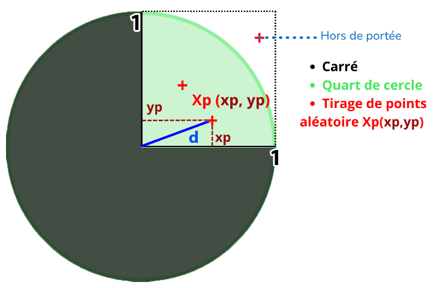
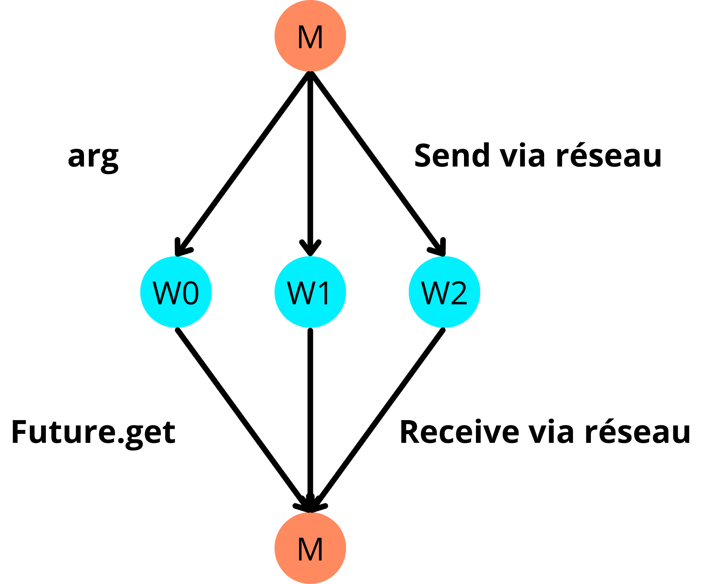

# Prequel
Les composants pouvant changer d'une machine à l'autre (et qui pourraient donner différents résultats), il est donc important de spécifier les configurations matérielles utilisées dans ce rapport. 
## Configuration matérielle utilisées :
| Composant      | Mon ordinateur portable                   | Ordinateur de l'Université (G26) |
|----------------|-------------------------------------------|----------------------------------|
| **CPU**        | Intel Core i5-11400H @ 2.70GHz            | Intel Core i7-7700 @ 3.60GHz     |
| **GPU**        | NVIDIA GeForce RTX 3050 (4GB)             | Intel HD Graphics 630            |
| **RAM**        | 32,0 Go 3200 MHz                          | 32,0 Go 2400 MHz                 |
| **Carte mère** | ASUSTeK COMPUTER INC. FX506HCB (U3E1)     | Dell 0PMYYJ                      |
| **Stockage**   | 476GB NVMe INTEL SSDPEKNU512GZ (RAID SSD) | SanDisk X400 2.5 7MM 512GB       |

## Informations :
Afin d'améliorer la qualité du rapport, j'ai utilisé des outils d'IA générative pour réduire les fautes et mieux comprendre certaines notions.

# Introduction

Ce cours a pour but de tester les performances du **parallélisme** avec deux architectures à **mémoire partagée** : **Pi** & **Assignment102**. Ainsi qu'une architecture à **mémoire distribuée** : **Master/Worker Socket**, que nous allons approfondir en l'utilisant sur plusieurs machines lors de la dernière séance.

Pour ce faire, nous allons utiliser la méthode de **Monte-Carlo**, en référence au casino éponyme de Monte-Carlo. L'objectif de cet algorithme probabiliste est de calculer une approximation de π.

Nous étudierons ici la **scalabilité** apportée par le parallélisme de chacune des paradigmes ainsi que leur positionnement sur la norme **ISO 25010**.
# Sommaire :
<!-- TODO : à la fin -->

# I/ Définitions

## 🧠 Mémoire
La mémoire **RAM** (Random Access Memory) permet à l'ordinateur de stocker temporairement les **données** et **instructions** des programmes en cours d’exécution dans des zones de mémoires.
### 🔗 Mémoire partagée
La mémoire partagée est un modèle où plusieurs **processus** accèdent directement à une même zone de **mémoire physique**. Ils peuvent **lire** et **écrire** dans cet espace commun, facilitant un échange rapide de données. Cette notion nécessite de revoir le précédent rapport dans lequel nous étudions la notion de **verrou MUTEX** qui permet de s'assurer de **l'intégrité des données partagées**.
### 📡 Mémoire distribuée
La mémoire distribuée est un modèle où chaque **processus** accède uniquement à sa **propre zone de mémoire**. La communication entre les processus se fait par **échange de messages**, nous retrouvons en général **un récepteur** et **plusieurs émetteurs**.
## ⚡ Parallélisation
La parallélisation consiste à diviser une **tâche complexe** en **sous-tâches**. Elles peuvent être ensuite être exécutées en **parallèle** afin d'accélérer la tâche complexe en utilisant le **maximum de ressources locales**. Ce processus d'exécution simultanée des sous-tâches est appelé d'exécution simultanée des sous-tâches est appelé **parallélisme**. Il s'oppose à la notion de **séquentiel/itération**, qui se contente d'exécuter simplement les tâches les unes après les autres.

## 📈 Scalabilité
La scalabilité désigne la capacité d’un système, d'une application ou d'une infrastructure à s'**adapter à l'augmentation de la charge de travail** ou à **l'extension de ses ressources** sans perdre en performance ou en efficacité.
### 🚀 Scalabilité forte
La scalabilité forte est la capacité d'un système à **augmenter sa performance** en fonction du nombre de ressources allouées. Pour la mesurer, on divise la **charge initiale** par le **nombre de ressources** :

$$\text{Scalabilité forte = }\frac{\text{Charge initiale}}{\text{Nombre de ressources}}$$

Généralement, on vient comparer cette métrique avec une **linéaire**. La scalabilité forte devrait être **croissante**, car plus on alloue de ressources, moins la charge est importante pour chacune des ressources. Si j'ajoute **p** plus de ressources, je devrais aller **p** plus vite.

De plus, dans un système bien conçu, la seule opération potentiellement coûteuse est la gestion de la ressource critique qui cumule les résultats. Toutefois, cette opération devient négligeable lorsque le temps de calcul diminue significativement grâce à la répartition efficace de la charge entre les ressources.

Son objectif est de vérifier si le système peut **réduire le temps d'exécution** en **augmentant le nombre de ressources allouées**.

<!-- TODO : Parler de iso vitef -->  
### 🐢 Scalabilité faible 
La scalabilité faible est la capacité d'un système à **maintenir une performance stable** malgré l'augmentation de la charge, en ajoutant proportionnellement des ressources. Pour la mesurer, on multiplie la **charge initiale** par le **nombre de ressources** :

$$\text{Scalabilité faible = Charge initiale } \times \text{ Nombre de workers}$$

Généralement, on vient comparer cette métrique avec une **constante**. La scalabilité faible devrait s'approcher de cette **constante**, car la charge est proportionnelle aux ressources allouées.

De plus, dans un système bien conçu, la seule opération potentiellement coûteuse est la gestion de la ressource critique qui cumule les résultats. Toutefois, cette opération devient négligeable lorsque les tâches sont correctement réparties entre les ressources.

Son objectif est de vérifier si le système peut **absorber une charge croissante sans dégrader la vitesse d'exécution globale**.

<!-- TODO : Parler de iso vitef -->
## 📄 Norme ISO 25010
- Fonctionnalité (Functional Suitability)
- Efficacité (Performance Efficiency)
- Facilité d'utilisation (Usability)
- Fiabilité (Reliability)
- Maintenabilité (Maintainability)
- Portabilité (Portability)
<!-- TODO :  FINIR -->
# II/ Monte-Carlo
Il est maintenant important de présenter ce qu'est l'algorithme de Monte-Carlo, car nous allons comparer plusieurs implémentations de cet algorithme dans les architectures à mémoire partagée et distribuée.

L'expérimentation se base sur la génération aléatoire de points dans un carré de côté 1 et la détection de ceux qui tombent dans le quart de disque inscrit. Le nombre de points valides et le nombre total permettent d'estimer la valeur de π.

**Figure 1 :** Illustre le tirage aléatoire de points xi de coordonnées (xi, yi) où xi et yi suivent une loi U (]0,1[]). La probabilité qu'un point Xi soit dans le quart de disque est telle que :


## 1. Définition des aires :

Soit un **carré de côté 1** et un **quart de disque de rayon 1** :  
- $\text{Aire du carré} = r^2 = 1 $
- $\text{Aire du quart de disque} = \frac{\pi \times r^2}{4} = \frac{\pi}{4}$

## 2. Probabilité qu'un point soit dans le disque :

$$ \text {On tire aléatoirement des points } ( (x_i, y_i) ) \text { qui suivent une loi uniforme (U(0, 1)) représentant les cordonnées d'un point}$$

$$ \text {La distance d'un point } ( (x_p, y_p) ) \text { à l'origine est donnée par }$$ 
$$d = \sqrt{x_p^2 + y_p^2}$$

La condition pour qu'un point soit dans le quart de disque est : $$d \leq 1 $$

## 3. Calcul de la probabilité :

$$ \text {La probabilité qu'un point } ( X_i ) \text { soit dans le quart de disque est : }$$ 
$$ P(X_i / d_i < 1) = \frac{\text{Aire du quart de disque}}{\text{Aire du carré}} = \frac{\pi}{4}$$

## 4. Calcul de π
On effectue **n tirages** aléatoires

$$\text{Si } ( n_{\text{total}} ) \text{ est grand, alors on approche :} $$
$$P(X_i / d_i < 1) \approx \frac{n_{\text{cible}}}{n_{\text{total}}} $$
$$ \text{où } ( n_{\text{cible}} ) \text{ est le nombre de points dans la cible (quart de disque).}$$

On peut alors approcher π par :
$$ \pi \approx 4 \times \frac{n_{\text{cible}}}{n_{\text{total}}}$$

# III/ Différents paradigmes de programmation
## 1. Algorithme séquentiel
```java
ncible = 0;
ntotal = 1200000;
// T1
for (i=0; i<ntotal; i++) {
        xi = Math.random();
        yi = Math.random();
        // T2
        if xi**2 + yi**2 < 1 {
            ncible++
        }
}
// T3
Pi = 4(ncible/ntotal); 
```
- Tache 1 : Générer des points aléatoires dans le carré
- Tache 2 : Compter le nombre de points dans le quart de disque
- Tache 3 : Calculer π

Le problème que rencontre cet algorithme est qu'il est **séquentiel**. On est limité, car on peut tirer les points qu'un à la fois. Cela peut être long si le nombre de points est très grand. Il n'offre aucune possibilité de parallélisation.
## 2. Algorithme parallèle
```java
ntotal = 1200000;
AtomicInteger ncible = new AtomicInteger(0);
ExecutorService executor = Executors.newFixedThreadPool(Runtime.getRuntime().availableProcessors());
// T1
for (int i = 0; i < ntotal; i++)
    executor.execute(() -> {
        double xi = Math.random(); 
        double yi = Math.random();
        // T2
        if (xi * xi + yi * yi <= 1)
            ncible.incrementAndGet();
    });
executor.shutdown();
while (!executor.isTerminated()) {
}
//T3
Pi = (4.0 * ncible.get() / ntotal);
```
- Tache 1 : Générer des points aléatoires dans le carré
- Tache 2 : Compter le nombre de points dans le quart de disque
- Tache 3 : Calculer π

On retrouve les mêmes précédentes tâches, sauf que les tâche 1 et 2 sont parallélisées. Chaque point est traité par un thread différent, ce qui permet de gagner du temps. On utilise ici un **AtomicInteger** en tant que verrou MUTEX pour éviter les problèmes de **synchronisation**, car **ncible** est une ressource critique.
## 3. Master/Worker
L’architecture Master/Worker est similaire à la programmation parallèle, cependant elle a un avantage majeur. 

Chaque Worker peut travailler avec ses propres variables locales. Cela réduit les conflits, car les Workers n’ont pas besoin de se synchroniser constamment pour accéder à des ressources partagées. Ce qui permet d'obtenir une meilleure scalabilité. 

De plus, la modularité de cette architecture permet d’aller encore plus loin, en exécutant les Workers sur différentes machines, ouvrant la porte à des systèmes distribués. C'est ce que nous allons étudier dans la suite de ce rapport.


**Figure 2 :** Illustration de l'architecture Master/Worker. Le Master envoie des tâches aux Workers qui les exécutent en parallèle. Les Workers renvoient les résultats au Master qui les fusionnent pour obtenir le résultat final.
### Sockets
Pour cette implémentation, nous allons utiliser des **sockets**. Les sockets sont des points de communication qui permettent d'établir une connexion entre deux machines ou un processus sur un réseau. Ils communiquent en utilisant les protocoles **TCP** (Transmission Control Protocol) ou **UDP** (User Datagram Protocol). La connexion la plus sûre reste la **TCP**. Ils sont définis à travers les ports de l'ordinateur.

On y retrouve un Socket **Server** (équivalent de Master), qui est à l'écoute des connexions entrantes, et un Socket **Client** (équivalent de Worker) qui initie la connexion.

# IV/ Études des implémentations
La plupart de ces implémentations utilisent l'**API Concurrent** de Java, qui permet de gérer plus facilement les threads et les ressources partagées. Cela permet de simplifier la gestion des ressources critiques et de la synchronisation.
## 1. Pi.java
Dans ce cadre-là, nous utilisons la mémoire partagée.

La spécificité de cette implémentation est qu'elle utilise les Futures, Threadpools et Callable de l'API Concurrent. Cela permet de gérer plus facilement les threads et les ressources partagées.
* Les **Futures** sont des objets représentant le résultat d'une opération asynchrone. Ils permettent de soumettre une tâche à exécuter par un autre thread et de récupérer le résultat une fois la tâche terminée, en bloquant si nécessaire jusqu'à ce que le résultat soit disponible. Cela facilite la gestion des threads et des ressources partagées (cf [Rapport1.md](Rapport1.md)).
* Les **Callables** sont des objets permettant de soumettre une tâche asynchrone qui retourne un résultat. Utilisés pour des calculs ou des opérations produisant une valeur, ils sont complémentaires aux Futures et facilitent la gestion des threads ainsi que des ressources partagées.
* Les **ThreadPools** sont des groupes de threads pré-instanciés, prêts à exécuter des tâches asynchrones. Ils permettent de gérer et réutiliser des threads, réduisant ainsi le coût de création et de destruction de threads à chaque nouvelle tâche. Leur utilisation optimise les performances et permet une gestion efficace des ressources. Dans notre cas, le ThreadPool va wrapper nos Workers.

### Structure UML de Pi.java


### Analyse de l'implémentation de Pi.java


- **Scalabilité Forte :** Les performances s'améliorent avec l'augmentation du nombre de cœurs (précisément lorsqu'on utilise 12 cœurs sur la config 'myLaptop'). Cependant, on constate que les courbes ont tendance à s'entremêler.
- **Scalabilité Faible :** Les performances restent stables lorsque le nombre de tâches et de travailleurs augmente proportionnellement, indiquant une bonne utilisation des ressources. Elles semblent tendre vers 0.8 tout au plus.

On remarque que malgré la hausse en charge les données "s'entremêlent", restent néanmoins très bonne. On peut donc conclure que cette implémentation à une excellente utilisation de ses ressources. Pi.java est **scalable**.

## 2. Assignment102.java
Dans ce cadre-là, nous utilisons la mémoire partagée.

La spécificité de cette implémentation est qu'elle utilise **AtomicInteger* et **newWorkStealingPool** de l'API Concurrent. Ces outils permettent de gérer les threads et les ressources partagées de manière plus efficace dans un environnement parallèle.
* L'**AtomicInteger** est un type spécial d'entier qui permet d'effectuer des opérations atomiques. Cela signifie que les mises à jour de cette variable sont sécurisées contre les conflits entre plusieurs threads. Il s'agit d'un verrou MUTEX qui permet de gérer les ressources critiques.
* Le **newWorkStealingPool** est un type de ThreadPool qui utilise le mécanisme de vol de tâches (task stealing). Cela permet à un thread inactif de voler des tâches à un autre thread qui est plus occupé.
### Structure UML de Assignment102.java

### Analyse de l'implémentation de Assignment102.java


- **Scalabilité Forte :** Les performances ne décollent pas (myLaptop), voir se décroit (G24) avec l'augmentation du nombre de cœurs. On ne se rapproche pas du tout du speed up idéal qu'est le speedup linéaire.
- **Scalabilité Faible :** Les performances chutent avec l'augmentation du nombre de cœurs et convergent vers 0.

Cette implémentation ne respecte aucun critère de scalabilité. Ce code n'est pas **scalable** car il serait moins performant si l'on essaierait de multiplier le nombre de workers.

## 3. Master/Worker Socket
Dans ce cadre-là, nous utilisons la mémoire distribuée.

(Par ailleurs, petite information inutile, mais j'ai créé le script **start_worker.bat** afin de pouvoir lancer les Workers plus rapidement. Cela m'a permis de gagner du temps lorsque je récupérais mes données.)

Cette implémentation utilise des Sockets dont on a donné la définition plus haut. Mais un petit rappel ne fais pas de mal.

Les Sockets sont des points de communication qui permettent d'établir une connexion entre deux machines ou un processus sur un réseau à travers la déclaration de ports sur la machine.
### Structure UML de Master/Worker Socket


### Analyse de l'implémentation de Master/Worker Socket


- **Scalabilité Forte :** Les performances s'améliorent avec l'augmentation de la charge initiale. Le plus on lui donne une charge importante, le meilleur sera sa scalabilité. Par extension, les courbes sont de plus en plus croissantes et se rapprochent du speedup linéaire en fonction de la charge et du nombre de ressources allouées.
- **Scalabilité Faible :** Tout comme la scalabilité forte, les performances s'améliorent avec l'augmentation de la charge initiale. Plus on lui donne une charge importante, le meilleur sera sa scalabilité. Les courbes sont de moins en moins décroissantes et se rapprochent de la constante.

On remarque que plus la charge est importante et que le nombre de processus est haut, le meilleur est la scalabilité. Cette implémentation à une bonne utilisation de ses ressources. WorkerSocket.java & MasterSocket.java sont **scalable**.

# V/ Conclusion


En interprétant le graphique visuellement, on peut voir que les performances de **Pi.java** et **Master/Worker Socket** sont nettement meilleures que celles de **Assignment102.java**. En effet, on a pu déterminer que ces deux implémentations étaient **scalable** tandis que Assignment102.java ne l'est pas. Cela est dû à une mauvaise gestion des ressources critiques et des threads. 

On pourrait croire que la meilleure des trois implémentations est **Pi.java**. Car ses performances semblent supérieurs à **Master/Worker Socket**. Cependant, il est important de noter que **Master/Worker Socket** est plus performant que **Pi.java**. Nous avons vu précédemment que la scalabilité de **Master/Worker Socket** est plus importante que celle de **Pi.java**. Parce qu'elle profite d'une meilleure performance lorsqu'il s'agit de traiter des charges de plus en plus importantes avec un nombre de ressources allouées plus élevé. En plus de cela, **Master/Worker Socket** profite de la mémoire distribuée, ce qui lui permet de mieux gérer les ressources critiques et les threads, comparé à **Pi.java** qui utilise la mémoire partagée.
